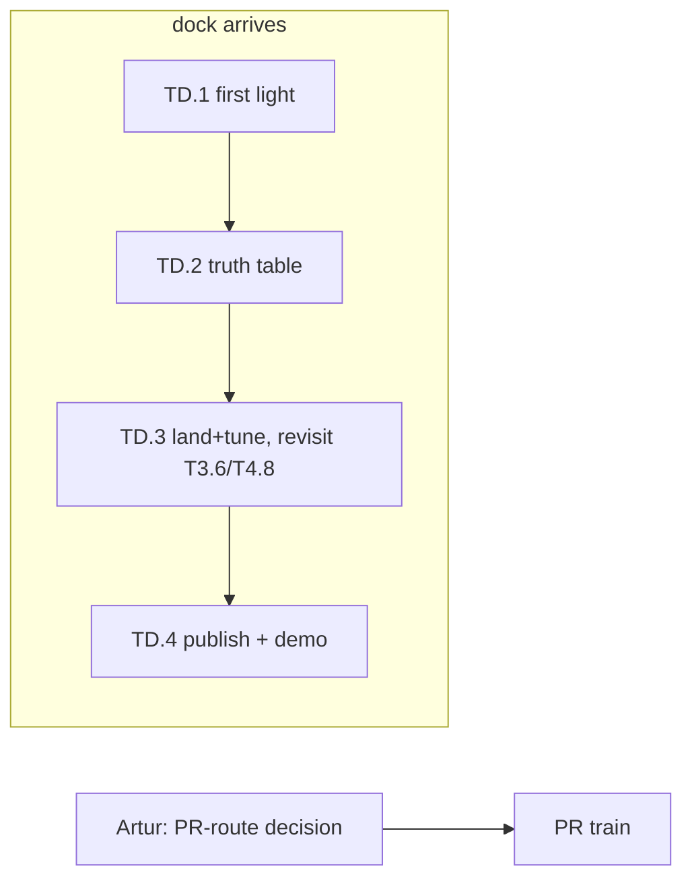

# TASKS.md — agent handoff for the Ampere-over-Thunderbolt effort

> **Next arc (drafted 2026-09-09, not started):** T4.91 `reasoning_effort` passthrough (every think:on request has run at the template default xhigh) → T4.92 model-card sampler defaults + presence penalty → T4.93 the 27B on the 3090 ALONE at 4-bit (measure first) → T4.94 MTP on that build. Entries at the end of the T4 section. **2026-09-10: all of the above is on master (43ac66739 == integration/t6). T4.93 measured and parked (K-quant 5.4 / Q4_0 6.9 tok/s: the generated gemv kernels cap every quant). NOW: T4.98 (hand-written NV quantized gemv, 6 subtasks, agents running), T4.99 host snapshots, T4.93b quality gate. Hermes/server deliberately DOWN for the experiments (Artur 09-10: \"Don't hesitate to stop it\").**

Task breakdown of `NV_LLM_DESIGN.md` (WS refs point there; context in `memory.md` — read both first).
Baseline `af2a43c85`; rebase on upstream master weekly. Written 2026-08-18, while the eGPU dock
(AOOSTAR AG02) was in the mail — **Phase 0 tasks need no NVIDIA hardware at all.**
**Dock + RTX 3090 LIVE 2026-08-24 — TD.1 ✅ + TD.2 ✅ COMPLETE in the first 24 h.**
Best decode config = `DEV=NV` (nvcc) + JITBEAM=2 on every model: llama3.2:1b **149.1 tok/s**
(exceeds the llama.cpp-CUDA 110-130 reference band), qwen3:8b **46.9** (1.73x llama.cpp-Metal),
gpt-oss:20b **60.9** (~4x Metal BEAM). Transport exonerated for decode (TD.2a); T4.14
compile-server bug found+fixed en route (prime PR candidate). **TD.3 CORRECTNESS PROGRAM
COMPLETE (2026-08-25): the FLAGSHIP works — real olmoe graphed METAL+NV MoE pooling, experts
on the 3090, byte-identical, decode 41.1 tok/s split vs 12.9 all-NV (3.2x).** Dense pooling
~80-90 µs/hop; T2.1 (+12% D2H) and T2.2 (2.51x map) validated; three PR-shaped fixes stacked
(T4.14, T4.17, T4.18) + protocol no-free-verb finding for tinygpu_releases. Remaining: BEAM'd
pooling perf rows (bench window), T4.15/T4.16 filler, kernargs pooling (T4.18 headroom),
PR-train route decision.

> **STATUS 2026-08-21 (Phase 0 COMPLETE):** 8 agent waves + 4 bench windows, ~55 tasks closed
> (✅/❌/📋 markers below; the **Status log** is the authoritative record). **All pre-dock code
> work is DONE and measured.** Bench window 4 confirmed T4.13 at real scale: gpt-oss-20b decode
> 1.69 → **10.97 tok/s no-BEAM / 15.52 BEAM** (bytes 59.3 → 3.46 GB/token); long-context gpt-oss
> is now attention-COMPUTE-bound on Metal → sm_86 case. Headline: qwen3:8b METAL decode 7.38
> no-BEAM / 14.40 BEAM vs llama.cpp 27.1. **PR #1 (integration/wave1 → fork master) MERGED** —
> fork `master` (`457e1a915`) now carries all Phase 0 work on top of upstream `b8cc74ecf`.
> Remaining: the on-hold **PR train** (T4.9 → T4.13 → T4.7+T1.8c-fix → T4.2 → T4.1 →
> T1.5/T1.6/T2.1/T2.2; submission gated on Artur's route decision — see memory.md §6 2026-08-20,
> AI disclosure mandatory), optional T2.4 (rented 3090), and the dock (TD.x). Closed pre-dock:
> fused attention (T4.8 final no-go — machinery built, waits for sm_86), Stage B bridge (parked
> for TD.3).

## Conventions for agents

- Branch per task: `task/T<id>-<slug>` **off fork `master`** — now **`0a2fb4cce`** (the PR #5 merge,
  2026-08-26: upstream sync #4 + the complete client-side panic remediation — T4.37 + 40-1/40-2 (T4.40b) +
  40-4 (T4.40a); fork line-cap 27000; `integration/phase1b` retired). No local `master` branch
  exists. **`origin` is the SSH remote and is interactive-only: fetch AND push via the explicit
  HTTPS URL** (`git fetch https://github.com/arttarawork/tinygrad.git master`) or `origin/master`
  will silently sit stale. Retired as bases (content fully in `master`): `integration/wave1`, `integration/phase1b`,
  `task/TD.3-pooling`, `task/T4.27-beam-silent-fallback`, `task/T4.28-integration`. The old
  baselines `af2a43c85` / `457e1a915` / `b37d80fc9` apply only to their era's branches.
  Remotes: `origin` = arttarawork/tinygrad fork, `upstream` = tinygrad/tinygrad.
- Python env (Mac, verified 2026-08-18): no bare `python`; Homebrew python3.14 has no test deps.
  Use `/Users/artur/Documents/tinygrad/.venv` (numpy, torch, pytest+xdist, hypothesis, z3, gguf,
  mypy 1.19.1, ruff 0.14.10). From any checkout/worktree: `PYTHONPATH=. <venv>/bin/python -m ...`.
- Before pushing: `PYTHONPATH=. .venv/bin/python -m pytest <touched area> -x -q -n12`,
  `.venv/bin/python -m mypy tinygrad/`, `.venv/bin/python -m ruff check .`
- **llm-touching work also gets a `DEV=CPU` pass** (CI's Linux default; our METAL-default gates
  missed 3 real failures on PR #1 this way — see the 2026-08-19 fork-CI row).
- **Stagger pushes to `master` and feature branches** — concurrent pushes run two full CI
  matrices at once and starve the fork runners into setup timeouts (post-sync CI lesson).
- **Push the `memory` docs branch (and any unmerged evidence branch) after each session** —
  `git push https://github.com/arttarawork/tinygrad.git memory` — the docs and bench CSVs are
  the un-regenerable part of this project; local-only means one dead laptop loses the record.
- Fork pushes (2026-08-19): use `gh` — `gh auth setup-git` once, then push via explicit HTTPS URL
  (`git push https://github.com/arttarawork/tinygrad.git <branch>`); SSH works only from Artur's
  interactive shell. The gh token LACKS `workflow` scope: pushes touching `.github/workflows/`
  need Artur (or `gh auth refresh -s workflow`). CI logs/reruns: `gh run view --log-failed`,
  `gh run rerun <id> --failed -R arttarawork/tinygrad`. `gh run list --commit` needs the FULL
  40-char SHA — a short SHA silently matches nothing.
- **Worktree agents: use RELATIVE paths for repo files.** Absolute `/Users/artur/Documents/tinygrad/...`
  paths silently resolve to the shared checkout (different branch!) — a T2.5 agent lost time to a
  phantom "stale file" bug this way. Absolute paths are correct only for the venv and model caches.
- Mac resource limits (updated 2026-08-18, after Artur freed ~157 GB): **~179 GB disk free** —
  model downloads are now fine (bench GGUFs go through `tinygrad.llm`'s fetch cache; gpt-oss-20b
  MXFP4 for T1.3 validation OK). **llama-server still keeps ~23 GB wired** (LaunchAgent KeepAlive)
  — before real-model METAL runs / T0.1 benchmarks, stop it: `launchctl bootout gui/501/com.artur.llama-server`
  (restart: `launchctl bootstrap gui/501 ~/Library/LaunchAgents/com.artur.llama-server.plist`).
  **Bench window RETIRED 2026-08-27: llama-server is gone; the pooled server (`~/bin/pooled-serve.sh stop` before, `start` after)
  is what a `DEV=NV` bench run now displaces.**
  **Before stopping, check Hermes isn't mid-scheduled-task**: its 9 auxiliary text tasks
  (compression, triage, …) AND its last-resort fallback provider run on this llama-server —
  both degrade for the whole bench window (~/CLAUDE.md "Hermes wiring" has the details).
  Tiny random-weight configs are fine anytime.
- Perf claims need before/after numbers from the T0.3 harness on named hardware. Upstream-bound
  changes must be small and hand-verified — maintainers have reverted "ai slop" before (see memory.md §4).
- Don't remove the deliberate `.contiguous()` calls in the MoE expert path (`llm/model.py:27,129`).
- `PYTHONPATH=.` when running from the clone.

## Execution environments

| Tag | Meaning |
|---|---|
| `ANY` | pure code; NULL/CPU device is enough (kernel-count and scheduling tests run on `DEV=NULL`) |
| `MAC` | the MacBook M3 Pro — Metal backend, real perf numbers today |
| `AMD` | (descoped 2026-08-18 — see T0.2; kept for the footgun note) the Bazzite box w/ RX 9070 XT. **Never** use the AM/PCI driver path there: it unbinds `amdgpu` and kills the display. |
| `MOCKNV` | NV backend under gpuocelot PTX emulation — functional correctness only, no perf. Recipe (T0.4, verified 2026-08-18): `OCELOT_PATH=.venv/lib/libgpuocelot.dylib DEV=MOCK+NV:PTX PYTHONPATH=. .venv/bin/python -m pytest ...` — the `DEV` string must start with `MOCK` (`device.py:376` never falls back to `MOCKIface` otherwise) and the dylib is CI's prebuilt (`github.com/tinygrad/gpuocelot` release v0.1.0, already at `.venv/lib/`). Do NOT use `extra/setup_mock_nv_osx.sh` (heavy source build + sudo to /usr/local/lib; CI doesn't use it either). Details: `MOCKNV_SETUP.md` on `task/T0.4-mocknv`. |
| `CLOUD3090` | optional: a rented Linux 3090 (vast.ai etc.) runs the same NV backend/kernels via `NVKIface` — real sm_86 perf for kernel work before the dock arrives |
| `DOCK` | AG02 + 3090 arrived 2026-08-23; live once TD.1 first light passes |

## Phase 0 — no dock required

### T0 · Bring-up & baselines

- **T0.1 ✅ — Metal baseline table** `[MAC]` deps: —
  Clone on the Mac; run `python -m tinygrad.llm -m qwen3:8b --benchmark --warmup` (and qwen3.6:27b,
  qwen3-30b-a3b) on `DEV=METAL`, with and without `JITBEAM=2`; same GGUFs through `llama-bench` (Metal).
  *Done when:* a committed CSV/table of load / prefill / decode tok/s for ≥3 models × both stacks.
- **T0.2 — ~~Verify the 9070 XT as an HCQ testbed~~ DESCOPED (2026-08-18)** `[AMD]`
  AMD is not a target; the box was only a real-HCQ stand-in for validating shared `hcq.py` changes
  pre-dock. That role is covered better by `CLOUD3090` (same backend as target, NVKIface) and by
  upstream CI's AMD runners. Revive only if a cheap local HCQ sanity-check ever beats renting.
- **T0.3 ✅ — Bench harness** `[MAC]` deps: T0.1 (WS5.1)
  One script: same GGUF → `tinygrad.llm` + `llama-bench`, emits CSV (model, dev, flags, load s,
  prefill t/s, decode t/s, GB/s from `GlobalCounters`). Validated on Metal now; reused on NV later.
  *Done when:* T0.1's table is reproducible with one command.
- **T0.4 ✅ — Mock-NV bring-up** `[MOCKNV]` deps: —
  Get `DEV=NV` under gpuocelot green for `test/test_tiny.py` locally (Mac or Linux). Document setup
  quirks. This unblocks all NV-touching code tasks pre-dock.
  *Done when:* documented one-shot setup + passing test_tiny.

### T1 · Decode-path kernels & dtypes (WS1) — all measurable on Metal today

- **T1.1a ✅ — fp16 KV cache: implement + accuracy** `[ANY, runnable anytime]` deps: — (WS1.1)
  Explicit KV dtype at `llm/model.py` `_init_state` (default fp16, `KV_F32=1` escape flag); check
  every `_init_state` variant (attention, MLA, SSM conv/state — SSM state may need fp32, decide
  per-block with evidence). Accuracy: greedy-token parity + max logit delta vs fp32 over ≥5 prompts
  on llama3.2:1b (1 GB, fits anytime) AND a recurrent tiny-config. STOP if any family needs
  >1-line special-casing — report instead.
  *Done when:* diff + accuracy table committed; upstream-PR-shaped. Perf is T1.1b, not this task.
- **T1.1b ✅ — fp16 KV: measure decode delta** `[MAC, bench window]` deps: T1.1a, llama-server stopped
  T0.3 harness, qwen3:8b, fp32-KV vs fp16-KV on integration, no-BEAM + JITBEAM=2, long-context
  variant (`-p 4096`) where the KV read dominates. *Done when:* CSV rows + delta in BENCH_NOTES.md.
- **T1.2 ✅ — MATVEC heuristic: see through CAST** `[ANY→MAC]` deps: T0.1 (WS1.2)
  Reproduce the miss: `DEBUG=3` on a fp16/Q4 gemv, confirm no `MATVEC:` line (guard at
  `codegen/opt/heuristic.py:60-78` requires `MUL(INDEX,INDEX)`, real ASTs wrap it in CAST).
  Patch guard, add a kernel-selection unit test (NULL device), measure decode on Metal.
  *Done when:* heuristic fires on fp16+quantized gemvs; no regressions in `test/opt/`.
- **T1.3 ✅ — gpt-oss arch in `tinygrad/llm`** `[MAC]` deps: T0.1 (WS1.6)
  Wire the `gptoss` GGUF arch into `llm/model.py:340-451` + registry (`cli.py:76-94`); MXFP4 dequant
  already exists (`gguf.py:105-114`); training-side reference in `examples/mlperf/`. Validate
  gpt-oss-20b MXFP4 (~12 GB, fits the Mac's wired budget) output vs llama.cpp same-seed greedy.
  *Done when:* `-m gpt-oss:20b` generates correct text on Metal; benchmark row added.
- **T1.4 — Single-kernel MoE top-k — RESOLVED-AS-MEASURED (2026-08-18): premise was wrong.**
  `pairwise_topk` already costs exactly **1** kernel/layer in-model (control experiment on NULL:
  real topk vs free `arange` sel, all gating paths, T=1 and T=8). The scatter+slice+cast lower to
  an inlined select chain; only the rank reduce realizes, and rangeify's `remove_bufferize`
  (rangeify.py:258-282) makes 1 the floor (buffer-reading REDUCE can't inline into a consumer
  reduce). Alternatives (one-hot select, int32 scatter, `Tensor.topk` bitonic) all equal or worse.
  Landed tests-only (+19): exact tie-break equivalence vs numpy stable argsort + kernel-count pin.
  The other ~3 routing kernels/layer are the caller's probs path (gather + softmax stats,
  model.py:124-127) — a different, larger task if ever worth it.
- **T1.5 ✅ — Skip RNG at temperature 0** `[ANY]` deps: — (WS1.5)
  `llm/model.py:358-364`: bypass Gumbel noise when temp==0 without retriggering JIT capture.
  *Done when:* argmax path drops the threefry work; greedy outputs identical.
- **T1.6 ✅ — Cache `_prepare_jit_inputs`** `[ANY]` deps: — (WS2.4-adjacent)
  `engine/jit.py:200-218` re-derives state dicts every call (~0.5 ms/token host). Memoize safely.
  *Done when:* host time/token measurably down on Metal; JIT tests green.
- **T1.7 ❌ — Fused-attention track A: PCONTIG — DEAD END (2026-08-18).** PCONTIG fusion is
  numerically WRONG on multi-pass reduces (masked by the SCACHE bug T4.9 fixed), crashes Metal
  threadgroup limits at real GQA shapes, and sizes on-chip buffers by a symbolic Variable's static
  upper bound (compile crash at real max_context). Evidence: `PCONTIG_ATTN_NOTES.md` (merged).
  Do not wire PCONTIG into tinygrad/llm. Fused attention now routes through T4.7 ✅ → T1.8c → T4.8.
- **T1.8 ✅ — Fused-attention track B: pluggable custom kernel** `[MAC]` deps: T0.1 (WS1.4b)
  Add a clean attention-override hook in `llm/model.py:196` (pattern: `STUB_ATTENTION`,
  `extra/models/llama.py:104-119`; `Tensor.custom_kernel` is tested). Prove it with a naive Metal
  custom kernel; the tuned sm_86 kernel is T2.4/TD-side.
  *Done when:* hook merged behind a flag; parity test vs SDPA passes.
- **T1.10 ✅ — MATVEC for quantized (GGUF-fused) gemvs** `[MAC]` deps: T1.2 (WS1.2 follow-up, found 2026-08-18)
  T1.2 fixed fp16 but confirmed quantized gemvs miss MATVEC for two deeper reasons: the weight
  operand is a whole dequant expression (e.g. Q4_0: `MUL(INDEX, MUL(CAST(ADD(BITCAST(AND(...)))), ...))`
  with 3 INDEXes into one uchar buffer), and GGUF block substructure splits the row axis into
  multiple global axes (`full_shape=[32,2,16,1024]`). These are the dominant decode kernels for
  Q4_K models. Needs its own pattern match (or BEAM-informed hand-coded opts), not a CAST strip.
  *Done when:* MATVEC-class opts fire on Q4_0/Q4_K gemvs; measured GB/s uplift on Metal; no test/opt regressions.
- **T1.8c ✅ — Symbolic-Tk tuned attention kernel** `[MAC]` deps: T4.7 ✅ — done 2026-08-19: fires every token, byte-identical, ~2-3% slower than SDPA chain on 1B (T4.8 parked; qwen3:8b datum pending). Original scope:
  T4.7 made `custom_kernel` accept symbolic dims, but T1.8b's tuned kernel still can't fire past
  token 1: its CHUNK staging is a Python-level loop (`n_full = Tk // chunk; for j in range(...)`)
  needing a concrete int Tk. Rewrite the chunking kernel-side (a `UOp.range` over chunk index with
  a tail guard — no Python branching on Tk), keep the T1.8b structure (LOCAL threads, shared-mem QK,
  online softmax) otherwise. Then flip the fallback gate in `tinygrad/llm/attn_kernel.py`, verify
  T1.8's parity suite + `test_custom_kernel_symbolic_tk` pattern at symbolic Tk, and measure real
  llama3.2:1b decode with FAST_ATTN=1 (kernel now fires EVERY token) vs FAST_ATTN=0 — byte-identical
  tokens required. Honest expectation: still slower than the SDPA chain until T4.8 lands warp
  reduction — the deliverable is the working symbolic kernel + measurement, win or lose.
  *Done when:* gate flipped, parity green, real-decode delta measured. STOP if kernel-side chunking
  hits a codegen wall — document verbatim.
- **T1.9 ✅ — Streaming GGUF load** `[MAC]` deps: T0.1 (WS2.3-adjacent)
  Replace whole-file blob (`llm/gguf.py:134`) with per-tensor staging to cut the ~2x transient and
  TB-load cost; keep the io_uring fast path. Helps Metal load times immediately.
  *Done when:* peak load memory ≈ model size; load time not worse on Metal.

### T2 · Transport & runtime (WS2) — build now, tune on dock

- **T2.1 ✅ — Parallelize `_copyout`** `[MOCKNV→CLOUD3090]` deps: T0.4 (WS2.2)
  Mirror `_copyin`'s 32×2 MB round-robin (`hcq.py:559-576`) in `_copyout` (`hcq.py:596-609`).
  Shared HCQ code — write + functional-check under mock; real-hardware D2H bandwidth numbers from
  a rented 3090 (or post-dock). Upstream CI's AMD runners cover the AMD side of `hcq.py`.
  *Done when:* D2H bandwidth up on real NV hardware; `test/device/test_hcq.py` green.
- **T2.2 ✅ — Batch PTE writes / defer remote validation reads** `[MOCKNV]` deps: T0.4 (WS2.3)
  `nvdev.py:48-49` writes one 8-byte PTE per socket message; `memory.py:204-213` does blocking
  readback. Add a bulk-write path + skip validation on remote ifaces. Functional under mock; the
  latency win is measured post-dock.
  *Done when:* map_range socket-message count collapses (count messages in a fake iface test).
- **T2.3 ✅ — NV remote-tuning skeleton** `[MOCKNV]` deps: T0.4 ✅ (WS2.1)
  Prep a remote-keyed sizing layer for NV mirroring AMD's `is_usb()` knobs (`ops_amd.py:980-994`
  template): kernargs size, sigalloc, ring sizes, `bind()` bulk writes. Remote detection exists
  since T2.2 (`is_remote` on the MMIO iface). Values tuned post-dock; structure lands now.
  *Done when:* knobs exist with defaults = current behavior (mock-NV suites byte-green), one unit
  test asserting the knob set flips under a remote iface; no behavior change on NVK Linux path.
- **T2.4 — sm_86 kernel work on a rented 3090** `[CLOUD3090]` deps: T1.8 — *optional accelerator*
  Same NV backend, real tensor cores: BEAM sweeps on decode gemvs, tuned FA custom kernel for the
  T1.8 hook, MATVEC perf confirmation. Everything transfers to the eGPU minus transport.
  *Done when:* beam cache + FA kernel with measured tok/s vs Metal baseline.
- **T2.5 ✅ — Amortize the per-token sync** `[MAC]` deps: T0.1 ✅ (WS2.4)
  `generate()`'s per-token `.item()`: keep sampled tokens on device, drain every N for streaming;
  overlap the copyout with the next launch. Branch off `integration/wave1` (generate() moved:
  device-aware `t`/`temp` landed in review-fixes — re-locate the loop before scoping).
  *Done when:* host-visible stall/token down on Metal (T0.3 harness row); streaming UX unchanged (N≤4).

### T3 · Pooling groundwork (WS3 Stage A) — the sleeper: fully rehearsable pre-dock

Metal+CPU on the MacBook hits the *same three cross-backend blockers* as Metal+NV
(one-binary-per-`device[0]`, same-device kernel assert, no mixed graph capture) — so Stage A
can be built and proven before the dock ships.

- **T3.1 ✅ — Device-map plumbing in `tinygrad/llm`** `[ANY]` deps: — (WS3.A)
  `--device-map` (explicit ranges + `auto` by free memory): per-layer weight placement via
  `.to_()` before `load_state_dict` (loader honors pre-placed params, `nn/state.py:211-214`),
  per-layer KV-cache device (`model.py:200-204`), boundary copies at the `@function` block seam
  (`model.py:145-151`). Prototype homogeneous first: `("CPU:0","CPU:1")` / NULL.
  *Done when:* a model runs split across two same-backend devices with correct output.
- **T3.2 ✅ — Heterogeneous pipeline: METAL+CPU rehearsal** `[MAC]` deps: T3.1 ✅
  Swap one side for CPU. T3.1 already proved (homogeneous): mixed-device JIT capture works with no
  fallback, only COPY spans devices, and graph batching forms per-backend islands (METAL graphed,
  CPU sequential) — exactly the Stage A shape. Remaining here: do it cross-BACKEND, measure
  boundary cost/token, and **force realize for split models** (unrealized lazy initializers get
  captured and re-run every step — T3.1 finding).
  *Done when:* qwen3-8b runs layers split METAL/CPU, output correct, boundary cost quantified.
- **T3.3 ✅ — MoE placement policy** `[MAC]` deps: T3.2 ✅ (WS3.A)
  Sub-layer split: attention+norms+KV on device A, routed-expert FFN tensors on device B — extends
  `device_map` with per-tensor (not just per-block) placement for `ffn_*_exps`. Validate on a tiny
  MoE config first (exact-output test, both directions); then olmoe Q4 (~4.2 GB, registry —
  download OK, disk is fine) with experts on CPU and the rest on METAL (fits beside llama-server).
  Budget hops against T3.2's ~750 µs/copy floor — 2 hops/MoE-layer is the design's expected shape.
  *Done when:* MoE model runs with experts on the second device, outputs exact, hop count/token
  measured vs the 2/layer expectation. This is the flagship NV+METAL shape.
- **T3.4 ❌ — Zero-copy bridge spike (Stage B)** `[MAC]` deps: T3.2 ✅ (WS3.B)
  Wrap shared host memory across backends: `BufferSpec.external_ptr` on Metal (`ops_metal.py:157`
  at baseline — re-locate) over a CPU-visible buffer. The number to beat: T3.2 measured a
  **~750 µs FIXED cost per boundary copy** (overhead, not bandwidth) — if aliasing removes the
  copy, the hop cost should collapse toward sync-only. Target: eliminate the block-boundary
  activation copy in T3.2's METAL+CPU test pipeline, re-measure per-token cost. Also sketch (on
  paper, in the report) the HCQ-signal↔`MTLSharedEvent` bridge for the eventual NV side.
  *Done when:* one boundary copy eliminated + before/after per-token cost, OR analysis of why
  aliasing is unsafe (sync semantics, buffer lifetime, JIT capture) with the smallest viable alternative.
- **T3.5 — Boundary-copy microbenchmark — RESOLVED by T3.2 (2026-08-18):** METAL↔CPU table
  delivered (~750 µs fixed floor <1M elems, bandwidth above). Remaining: rerun on METAL↔NV post-dock.
- **T3.6 📋 — Async signal bridge — PRE-DOCK REHEARSAL REFUTED (2026-08-19), parked for the dock.**
  Bridge works (race-tested) but loses 20-35 µs net on METAL+CPU: CPU-producer sync is nearly free
  and Python dispatch (~300 µs) dominates; MetalGraph caps the drain cost in production. Capture-op
  design + sizing (~110-160 lines) in `SIGNAL_BRIDGE_NOTES.md` on the branch — revisit at TD.3
  when the producer is NV over the socket. Original scope kept below for that day:
- **(original T3.6 scope)** `[MAC→DOCK]` deps: T3.4 ❌ analysis
  T3.4 proved the boundary cost is SYNC (CPU-blocking `waitUntilCompleted` full-queue drain), not
  memcpy. Build the bridge: encode `MTLSharedEvent` `waitForEvent:value:` into the consuming Metal
  command buffer ahead of submit; a lightweight watcher signals it when the producer's HCQ signal
  word crosses the value (CPU HCQ2 signal for the pre-dock rehearsal; NV signal post-dock). The
  hard part is a JIT-capturable "wait on foreign signal" op — scope THAT first (where would it live
  in the captured graph? what does replay rebind?) and prototype METAL-consumer/CPU-producer on
  T3.2's split-model harness. Design sketch + primitives inventory: T3.4's report (`memory.md`
  session log pointer). *Done when:* one boundary hop runs without a full-queue drain, per-token
  cost measured vs the ~750 µs baseline, OR a scoped analysis of the capture-op gap. STOP before
  any scheduler surgery >~80 lines — report instead.

### T4 · Post-baseline work (added 2026-08-18, after waves 1-2 + measured baselines)

- **T4.1 ✅ — Upstream PR prep: MATVEC pair first** `[ANY]` deps: — (WS5/G3)
  Rebase `task/T1.2-matvec-cast` + `task/T1.10-matvec-quant` (as ONE combined branch off current
  `upstream/master`), re-run `test/opt/` + mypy + ruff, re-verify the fp16 + Q4_0 gemv wins still
  hold with a quick METAL microbench, and write the PR description: what/why, the measured numbers
  (56→100 GB/s fp16, ~4x membw Q4_0/Q6_K, and the +48% no-BEAM decode contribution from the
  baseline table). **Do NOT push or open the PR — Artur reviews and submits.** *Done when:* a
  rebased branch + PR-description file are ready for hand-off. (T1.5, T1.6, T2.1, T2.2 follow the
  same recipe as separate later tasks once this one lands cleanly.)
- **T4.2 ✅ — Q4_K dequant ALU cost** `[MAC]` deps: — (from T1.10's finding)
  T1.10 measured Q4_K gemvs ALU-bound (4x membw, flat wall-time; Q4_0/Q6_K got ~4x). Profile the
  Q4_K kernel (DEBUG=2 + generated source), identify the 6-bit sub-scale unpack cost, try ≤2
  targeted rewrites (e.g. restructure the scale-unpack expression in `llm/gguf.py` Q4_K dequant, or
  a BEAM comparison to see what search finds). STOP after 2 attempts if wall-time won't move —
  a written analysis is a valid outcome. Q4_K_M is the most common quant in the wild; this gates
  its decode win. *Done when:* Q4_K wall-time improves ≥15%, or the blocking analysis is committed.
- **T4.3 ✅ — gpt-oss-20b real-model validation** `[MAC, bench window — llama-server MUST be stopped
  (12 GB model)]` deps: T1.3 ✅
  `-m gpt-oss:20b` (GGUF cached): generate vs llama.cpp same-model same-prompt greedy (llama-cli
  `--temp 0`); token-level comparison over ≥3 prompts crossing the chunk_size=32 prefill boundary
  (exercises sliding-window × chunked-prefill, T1.3's untested interaction). Add a benchmark row
  via T0.3 harness while the window is open. *Done when:* parity verdict (exact or divergence
  documented with position/cause) + bench row committed.
- **T4.4 ✅ — BEAM prefill anomaly** `[MAC]` deps: — *small filler*
  Baseline table showed integration BEAM prefill 43.47 vs upstream 46.65 tok/s (single runs).
  3 repeats each side (harness exists); if the gap is real (>spread), bisect which wave lever
  costs prefill and why (likely MATVEC guard firing on a prefill kernel it shouldn't). STOP after
  attribution — fix is a follow-up. *Done when:* variance verdict or named culprit in BENCH_NOTES.md.

- **T4.7 ✅ — Upstream enabler: symbolic-shape `custom_kernel`** `[ANY]` deps: — (from T1.8b)
  `Tensor.custom_kernel` asserts `all_int(self.shape)`; the JIT's symbolic Tk therefore locks every
  custom kernel out of real decode. Investigate what breaks if custom kernels accept bound
  Variables (range construction? kernel cache key? memory planning?) and land the smallest
  upstream-shaped fix. Unlocks T1.8b's kernel AND T2.4's sm_86 flash kernel.
- **T4.8 📋 (scoped, deferred) — Upstream enabler: warp-reduce primitives in Metal renderer** `[MAC]` deps: — (from T1.8b)
  Metal codegen has no `simd_sum`/`simd_shuffle`; threadgroup_barrier+LOCAL is the only cross-lane
  reduction (measured dominant cost in T1.8b's kernel; caps custom kernels ~5% of bw). Scope what
  adding a simdgroup reduction primitive to the Metal renderer takes (renderer op, codegen
  pattern, correctness gating by threadgroup size). Benefits all GROUP reductions, not just attention.

- **T4.11 ✅ — gpt-oss decode reads ~25x too many bytes — NOT REPRODUCED at tiny scale (2026-08-19);** shared decode path exonerated (all 4 suspects refuted, regression test pinning <3x analytic); real-model chase moved to the bench-window docket. Original scope:
  Bench row (T4.3): gpt-oss-20b decode **1.69 tok/s at 100.65 GB/s** ⇒ ~60 GB read/token. Expected:
  ~2-3 GB (3.6B active params @ MXFP4 + KV) ⇒ ~30-40 tok/s ceiling. Something reads ~20-30x excess.
  Steps: (1) Reproduce at TINY scale first (synthetic gpt-oss config from `test_llm_gptoss.py`'s
  builder): measure `GlobalCounters.global_mem` per decode token vs the analytic expectation for
  that config — if the blowup reproduces small, iterate there (no 12 GB model, no bench window).
  (2) `DEBUG=2` kernel table for one decode step: which kernels read the excess? Suspects, in
  order: ExpertWeights gather degrading to dense-all-experts reads (check the `weight[sel]` kernel
  reads k experts' bytes, not E); the sinks manual-softmax path re-reading K/V multiple times;
  MXFP4 dequant materializing; masks built at full `max_context`. (3) Name the culprit; fix only
  if ≤2 targeted attempts move it, else commit the analysis. Real-model confirmation next bench
  window. *Done when:* culprit named with per-kernel byte attribution + fix-or-analysis committed.
  STOP if tiny scale does NOT reproduce — that finding (size-dependent, e.g. cache thrash) is the
  report; don't burn the window chasing it here.

- **T4.91 ✅ — Pass `reasoning_effort` through to the chat template (we have been running every thinking request at xhigh)** `[MAC]` deps: — (from the 2026-09-09 model-card check)
  *Landed 2026-09-09 (integration/t6 3fa9741fa):* one `EFFORT_LEVELS` table feeds template_kwargs and thinking_budget (minimal/low→low ÷8/÷4, medium→medium ×1, high→xhigh ×4, xhigh/max/ultra→xhigh unlimited, none/off→thinking off, other→medium); log shows `think:<level>`; 10 tests incl. one against the REAL GGUF template. Finding: the template injects text only for xhigh ('validate key assumptions, consider plausible alternatives…') and low ('keep your thinking brief…'); **medium injects nothing** — so medium simply removes the xhigh instruction we had been sending by default. A/B: see the Status log.
  `template_kwargs` in `tinygrad/llm/serve.py` maps Hermes's top-level `reasoning_effort` only to `enable_thinking`. The Qwen3.8 GGUF template
  (`tokenizer.chat_template`) takes `reasoning_effort` ∈ {low, medium, xhigh} (default **xhigh**; `high` → xhigh; any other value raises
  "Unexpected reasoning effort") and injects an instruction into the system prompt — xhigh: "think carefully through the task, validate key
  assumptions, consider plausible alternatives…", low: "keep your thinking brief and focused, moving directly to the conclusion…". So every
  think:on request served so far ran at xhigh, which is the instruction behind the 09-07/09-08 "consider the alternative" oscillations.
  Steps: (1) map minimal→low, low→low, medium→medium, high/xhigh→xhigh, none→`enable_thinking=false`; pass `reasoning_effort` only when
  thinking is on; (2) unit test with a stub template asserting the kwarg per Hermes value; (3) log the effective level in the request line
  (`think:medium`); (4) re-align the T4.88 THINK_BUDGET ladder to the three template levels; (5) note the prefix-cache implication: the
  instruction sits at the front of the prompt, so changing the level mid-conversation costs a re-prefill (Hermes holds `/reasoning` per
  conversation, fine). Deploy in an idle window (7-min restart). *Done when:* Hermes `/reasoning low|medium|high` produce the three template
  texts (verified in the rendered prompt), the request log shows the level, and on 3 prompts × 2 runs a medium think block is measurably
  shorter than xhigh with the same answer quality. STOP if the template raises on any Hermes value — map to the nearest level, never drop it.
- **T4.92 ✅ — Sampler defaults per mode, from the model card (temp 1.0 thinking / 0.7 + presence 1.5 non-thinking)** `[MAC]` deps: T4.91
  *Landed 2026-09-09 (integration/t6 97df22a1c):* `DEFAULT_TEMPERATURE_THINK` (falls back to DEFAULT_TEMPERATURE), `PRESENCE_PENALTY` (non-thinking only unless the request sends `presence_penalty`) as a (1,vocab) device mask updated eagerly per generated token, JIT key gains a (vision_on, penalty_on) pair only when either is active; not plumbed into speculative_generate. Default path byte-identical (tested). A/B done 2026-09-09 05:38 (Status log): DEFAULT_TEMPERATURE_THINK=1.0 shipped in the plist; PRESENCE_PENALTY left unset.
  Card: thinking → temperature 1.0, top-p 0.95, top-k 20, min-p 0, presence 0; non-thinking → temperature 0.7, top-p 0.8, top-k 20,
  presence 1.5 (presence 0-2 "to reduce endless repetitions", may cause language mixing). We run `DEFAULT_TEMPERATURE=0.6 MIN_P=0.05` for
  both (set 09-07 against greedy loops). Steps: (1) split the defaults by mode (`DEFAULT_TEMPERATURE_THINK`, `DEFAULT_TEMPERATURE`); keep
  min-p as the top-p/top-k surrogate (no sort/topk in the tensor lib) but measure min-p 0.05 vs 0 at temp 1.0; (2) presence penalty:
  `PRESENCE_PENALTY` env (default 0, applied to non-thinking requests) in `sample_logits` via a vocab-size presence-mask tensor updated
  once per token (a JIT input like the temperature tensor; no host round-trip); request `presence_penalty` overrides; (3) A/B on the 09-08
  stream-capture prompts: repeated-sentence share (the T4.89 metric), output length, loop-breaker firings, and a code-identifier sanity
  check (identifiers must still repeat under the penalty). *Done when:* mode-split defaults ship, presence penalty is measured, before/after
  numbers are in the Status log. STOP if temp 1.0 raises the repeated-sentence share or breaks tool-call JSON — keep 0.6 for thinking and
  record why.
- **T4.93 ⏸ — Qwen3.8-27B on the 3090 ALONE at 4-bit (UD-Q4_K_XL / Q4_K_M): measure before deciding** `[MAC+dock]` deps: — (from the
  *Parked 2026-09-09 after measurement:* UD-Q4_K_XL (16.35 GiB; embed Q4_K, head Q6_K, blocks Q3_K/Q5_K mix) fetched to `~/models/qwen3.8-27b-q4/`. On the 3090 alone it does NOT fit under the current loader/JIT: warmup dies on one ~4.9 GiB NV allocation (`0x13d800000`) that is independent of context (2k = 8k) and prefill chunk (8 = 32), shrinks only ~20 MB per block moved to METAL, and stays whether the EMBEDDING (`0:METAL`) or the HEAD (`63:METAL`) is moved off NV — i.e. a planned intermediate holding the dequantized fp32 vocab matrix (248,320 × 5120 × 4 B = 4.74 GiB) for whichever of the two remains, plus per-block scraps; the Q8_0 file does not show this (Q8_0 dequant fuses/fp16, K-quants apparently materialize fp32). With 16 blocks on METAL (`0-15:METAL,16-63:NV`) it fits and runs, but under cache-only BEAM the untuned Q3/Q5/Q6 kernels give **2.2 tok/s prefill / 0.71 tok/s decode** (Q8 pooled, same harness, same night: 18.3 / 4.34) — a kernel-tuning artifact, not the quant's speed. **Measured 2026-09-10 (Status log): tuned decode 5.42 tok/s (UD-Q4_K_XL) / 6.92 (Q4_0) vs 4.34 pooled — parked; the gemv kernels, not the quant, are the ceiling → T4.98.** **Unblocked 2026-09-09 21:50:** `KQUANT_STAGE=0` (task/T4.93-kquant-stage) makes it fit and run on the 3090 with only block 63 + head on METAL; untuned 0.715 tok/s decode; BEAM leg queued. **Root cause 2026-09-09 20:35 (Status log):** not the vocab matrices — on NV every K-quant weight's nibble unpack is materialized as a per-token uint8 intermediate inside the JIT'd step (the 4.9 GiB is the planner arena for those); CPU fuses the same expression. Next: make the K-quant unpack fuse on NV (scheduler rule) or hand-write NV K-quant gemv/gemm kernels; then a verified BEAM leg on `0-62:NV,63:METAL` for the real speed number. Harness rows: scratchpad t4x/bench_q4_*.log.
  2026-09-09 article review — syv-ai/qwen38-27b-rtx3090: 46 tok/s plain / 120-133 with speculation / 1.4-1.9k tok/s prefill on one 3090 at
  250 W, int4 body + int8 heads = 15.7 GiB, int8 KV, 150k ctx, IFBench 78.3 vs 79.5, GSM8K 96.5%; Quesma: Unsloth Q4_K_M ≈ BF16 on GPQA
  Diamond / IFBench / Terminal-Bench 2.1, 2-bit −few points and +25% tokens, 1-bit collapses)
  The pooled Q8 map (38 DeltaNet blocks on METAL over USB4) is map-bound: 4 tok/s decode, 19 tok/s prefill. A ~17 GB 4-bit GGUF + int8 KV
  (32 KB/token: 16 attn layers × 4 KV heads × 256 × 2) fits the 3090 with room for ~100k tokens; batch-1 decode is bandwidth-bound there
  (ceiling ≈ 936 GB/s ÷ 17 GB ≈ 55 tok/s; the launch-bound floor from the 35B run says 15-25 realistic), prefill has no hops.
  Steps: (1) fetch Unsloth `UD-Q4_K_XL` (fallback `Q4_K_M` v2) + `mmproj`; confirm tinygrad's Q4_K dequant path on this model (T4.2's ALU
  finding applies); (2) T0.3 harness on `DEV=NV` alone (`POOLED_DMAP=0-63:NV`), the 5547-token prompt: prefill tok/s, decode tok/s,
  first-token latency, NV memory at 32k/64k/100k; (3) quality: top-1 flip rate vs our Q8_0 on ~5k assistant tokens from the stream captures
  (greedy, same prompts, CPU or NV) + the vision battery; (4) if it wins: BEAM the new kernel set (verified, cache-only afterwards), state
  cache sizing on NV alone (snapshots now fit far more tokens), plist recipe. *Done when:* a before/after table on named hardware (tok/s,
  memory, flip rate, vision 3/3) and a go/no-go in the Status log. STOP if the Q4_K path faults or the first decode measurement is >2× slower
  than analytic — record and park. Never touch the standing Q8 recipe; it stays the fallback.
- **T4.94 📋 — Speculative decode on the 3090-alone build (MTP head)** `[dock]` deps: T4.93
  syv-ai: MTP with a cheap drafter took single-stream decode from 46 to 78-120 tok/s. Our tree ships greedy+sampled speculative decode and
  `--mtp` (OFF by default pending T4.73/T4.74). Enable `--mtp` on the T4.93 build, measure acceptance rate and tok/s at k=2..4 (their knee
  was k=4), keep the T4.73 WY-numerics caveat in view. *Done when:* a tok/s row with acceptance rates. STOP if outputs diverge from
  non-speculative greedy — speculation must be lossless.

- **T4.95 ✅ — Splice cache duplicates the previous assistant turn (`generate()` appends into the request's `ids`)** `[MAC]` deps: —
  *Landed 2026-09-09 (integration/t6 0f743882f, Sonnet worktree):* `list(ids)` at run_model's two generate calls; `TestSpliceCacheCopy` (3 tests, fakes that mutate their list like the real generate). cli.py untouched (its loop relies on the mutation).
  Found 2026-09-09 reading the live 27B session. `Transformer.generate` appends every generated token into the caller's list
  (`tokens.append`, model.py ~1791) and serve.py passes the request's `ids` itself, so after a reply `ids` = prompt + generated + EOS;
  `record` holds that mutated list and the next turn's `splice_ids` builds `prev_ids + gen + rest` → the previous turn sits TWICE in the
  model's context ([prompt][G][<|im_end|>][G][tool result…]) with a stray end-of-turn token between the copies. Every tool step silently
  prefills the previous output again (log: +new = out_prev + 1 + tool result — 09-08 18:57→19:27: +2781 = 1882+1+898, +2340 = 1090+1+1249,
  +2029 = 1764+1+264, +1922 = 1061+1+860, +481 = 159+1+321), the context inflates by the sum of the turn's outputs (~25.5k of the 87.6k
  prompt at 22:07; ~38k tokens ≈ 49 min of hidden prefill over the 10-hour turn), and the T4.88/T4.89 inject path duplicates the reasoning
  before the first nudge inside the same request (9,092 tokens at 14:13, 2,532 at 22:59 — the next request's `in:` exceeded prompt+out by
  exactly those). In the tree since T4.56 (2026-08-27), so the 35B era had it too. The unit tests fake `generate` without the append.
  Fix: pass a copy — `model.generate(list(ids), …)` at run_model's two generate calls (inject already builds a fresh list); or copy inside
  generate() if the CLI chat loop does not rely on the mutation. Regression test: a real `Transformer(TEST_CONFIG)` through the handler
  twice; assert `len(ids)` unchanged after run_model and no repeated block in the second request's ids. *Done when:* two consecutive
  tool-turn log lines show +new ≈ tool result only. STOP if cli.py depends on the appended list — then copy in serve.py only.
- **T4.96 ✅ — State cache never resumes a Hermes thinking session: boundary snapshots lost to two lingering references + tool-turn eviction** `[MAC+dock]` deps: —
  *Landed 2026-09-09 (integration/t6 b8138c8a0):* `s0` binding removed, `del snap` after restore, `boundary = cache_start_pos == 0` gates store_snapshot; 3 tests (weakref-liveness fake catches both leaks). Verify on the live log: the first request after a user message must show `in:<boundary>`, not `in:0`, and no more 'snapshot dropped' alternation.
  Evidence 09-08/09: every user message in a thinking session re-prefilled from zero (22:07 in:0+46344 = 47 min, 22:59 in:0+47419 = 47 min,
  00:26 in:0+48440 = 48 min, 14:13 in:0+59761 = 62 min). Qwen's template strips reasoning from every assistant turn before the latest user
  message, so the prompt diverges from the extend-only live cache at the turn's first think block; only a snapshot taken at the previous
  user boundary can bridge it, and that snapshot never survives: (1) `store_snapshot` keeps `s0` (the oldest snapshot dict) alive across
  its evict loop and run_model keeps `snap` (the restored one) alive for the whole request, so the evicted snapshot's NV buffers are still
  allocated when the new clone is made → "Allocation of ~100 MB failed on NV. Used: 22.4 GB, cache cleared" on every second request above
  ~45k tokens (perfect alternation, log lines 83921-83925; LRUAllocator already does free_cache+retry, so the memory is genuinely held);
  (2) under the 2 GB cap only one ≥30k-token snapshot fits, so the first tool-turn snapshot evicts the boundary one anyway; (3) above ~58k
  tokens the cap skips every snapshot. Net: zero snapshot hits this session while 1.7-2.1 GB of NV sat in a dead snapshot. Fix: `del s0`
  / `del snap` (two one-liners), then snapshot only requests that did not extend the live cache (cache_start_pos == 0 = a boundary) and
  pin that one — tool-turn snapshots only help retries. Expected: a user message costs the answer + tool results + new message (~1-2 min)
  instead of ~50 min, for sessions ≤ ~58k. Beyond: host-memory snapshots (the Mac sits at 38% free with 4 GB in the compressor — measure
  first) or keep sessions under 60k. *Done when:* a Telegram thinking turn's first request logs in:<boundary>, not in:0. STOP if NV
  headroom at 50k is below one snapshot after the fix — then the cap must drop to ~1.5 GB.
- **T4.97 ✅ — Loop breaker follow-ups: the nudge becomes the loop; tool calls inside the think block** `[MAC]` deps: —
  *Landed 2026-09-09 (integration/t6 0063ce08b + plist):* router `split2()` promotes a `<tool_call>` inside the think block to tool mode; detector skips sentences containing `= ; { } \` </`; `LOOP_NUDGES=0` in the plist and the deploy script (first repeated sentence → THINK_CLOSE). 4 tests.
  09-08 22:59 (in:0+47419): the first nudge fired on the model re-quoting the user ("is it possible to reference them to get a better");
  the model then echoed the nudge sentence verbatim 3× → nudge 2 → 3× → nudge 3 → 3× → close: 12 copies, zero progress, then a fine
  answer after THINK_CLOSE. 09-08 21:52 (in:81874+4664): after the nudge the model emitted `<tool_call>` INSIDE the think block (never
  `</think>`); the router kept it as reasoning_content, Hermes saw an empty response and appended its synthetic user nudge → user boundary
  → 47-min re-prefill. 09-08 14:13: the nudge on a code line (`let offtick = …`) changed nothing; the block ran on to 16,937 tokens.
  Levers: (a) `LOOP_NUDGES=0` (config only): the first repeated sentence closes the think block with Qwen's own sentence — in all three
  cases the immediate close would have been better; (b) router: `<tool_call>` inside reasoning mode ends the think block (promote to tool
  mode); (c) skip code-ish sentences (containing `=` `;` `(`) in the detector. *Done when:* a week of log lines with no "nudge n/3" chains
  and no empty-response nudges from Hermes. STOP if (a) truncates answers on the 09-08 capture prompts — then keep LOOP_NUDGES=1.

- **T4.98 🔄 — Hand-written NV quantized matmul kernels (the sm_86 gemv ceiling)** `[MAC+dock]` deps: — (from the 2026-09-10 Q4 legs)
  Every quant format measured on the 3090 decodes at ~100-120 GB/s effective (Q4_K_XL 5.42 tok/s, Q4_0 6.92, the Q8 map's NV share the same) — the
  tinygrad-generated gemv kernels, not the format, are the ceiling (isolated probe: a 44 MB gemv takes 585 µs = 75 GB/s; bytes alone would be 47 µs).
  `kernels/amd.py` already has the whole quantized-linear design for RDNA3 (q8 activation quantizer, dp4a per 32-weight group, one warp per output,
  Q4_K/Q5_K/Q6_K/IQ4_XS unpack, a WMMA gemm for prefill); `kernels/nv.py` (T6.2) has the NV custom-kernel mechanism (UOp graph + CUDA intrinsics via
  Ops.CUSTOM, nvrtc lane, JIT-captured). Subtasks:
  - **T4.98a ✅ launch floor** (12 µs/launch over the dock, ~7 ms/token floor — see the 12:40 Status row): time a jitted graph of N tiny kernels for N=50/200/600 (≈ the per-token launch count) → µs per launch
    over the dock. If >20 µs/launch the floor is ~12 ms/token = 80 tok/s and kernel fusion matters as much as kernel speed.
  - **T4.98b ✅ upstream scan** (nothing to cherry-pick for the gemv; two groundwork commits — see the 13:10 Status row): NV/CUDA codegen, tensor-core and BEAM-space changes upstream since our base af2a43c85 (08-18);
    cherry-pick candidates vs our patched files. If upstream's generated gemv already reaches >300 GB/s on sm_86, cherry-picking beats hand-writing.
  - **T4.98c ✅ code (merged a0714cf5a; device validation = T4.98d) gemv port** (agent): `kernels/nv_quant.py` — amd.py's decode kernel with `__dp4a`/`__byte_perm`/`__ldg` in place of the AMD builtins and
    nv.py's `__shfl_xor_sync` reduce; formats Q4_K/Q5_K/Q6_K/IQ4_XS (ported) + **Q8_0 and Q4_0 (new; 34/18-byte blocks are not 4-byte aligned → byte view)**;
    `NV_CUSTOM_QUANT=1` env gate in the Linear dispatch (default 0 = unchanged), single-token calls only; device-free tests (graph builds, CUDA source
    renders through the NULL backend's CUDA renderer, format decoders vs gguf.py's dequant on CPU); NV numerics + speed are mine on the device.
  - **T4.98d 📋 device validation** (mine): tolerance check vs the fused baseline (dp4a changes accumulation order — not bit-exact), the T6.4 verifier
    pattern re-applied to custom kernels, per-kernel GB/s, then the Q8 pooled map and the Q4 all-on-card decode numbers.
  - **T4.98e ✅ tooling** (merged fa02ff06b): `extra/launch_floor.py` and `extra/flip_rate.py` (teacher-forced top-1 flip rate between two model runs; the T4.93b
    quality metric), tested on the tiny model.
  - **T4.98g ✅ code (merged; device parity pending) fused GDN decode**: the recurrent-state readout+update for one block in ONE custom kernel (T6.2's scan is the prefill sibling; decode is still the unfused loop — `r_48_320_4_4` ×89 + `r_3_2_8_16_4_32_4` ×89 = 28 ms/token), and the launch count with it. Without it the gemv port stops near 9 tok/s.
  - **T4.98h ✅ code (merged; device numbers pending) f16 gemv for the small dense heads**: `ssm_alpha`/`ssm_beta` (5120→48, dense fp16) run as generic reduces at 0.249 ms each — 96 launches = 24 ms/token (16%). Upstream a0a901c8e's `f16_gemv` (one warp per output row) is the template; NV port behind the same `NV_CUSTOM_QUANT` gate. Expected: <20 µs per call.
  - **T4.98f 📋 gemm for prefill** (later): the WMMA path needs the sm_80 mma.sync fragment layout (different from RDNA3's wmma); prefill stays 16-19 tok/s
    until this lands. MTP verify (T4.94) rides on it.
  *Done when:* NV decode gemv ≥ 400 GB/s effective on the isolated probe, model decode on the Q4 all-on-card config ≥ 9 tok/s after (c) and ≥ 20 tok/s after (g), with a flip
  rate vs the fused path within noise. STOP if (a) shows the dock launch floor above ~30 µs (then fusion/launch batching is the real task) or (b) finds an upstream path.
- **T4.99 ✅ (2026-09-10, integration/t6) — Host-memory state-cache snapshots (`STATE_CACHE_DEVICE`)** `[MAC]` deps: T4.96 (agent)
  Snapshots live on the model's devices, so on the 3090 they compete with the weights (2 GB cap → nothing above ~58k tokens). With the LLM on the card the
  Mac's RAM is idle: `STATE_CACHE_DEVICE=CPU` (default unset = today) clones snapshots to the host and `restore_state` copies back (1.6-3.4 GB over
  USB4 ≈ 1-2 s vs a 50-min re-prefill); `STATE_CACHE_MB` then bounds host memory (raise to ~12288 once the model is off the Mac; on the pooled map the
  METAL share IS host memory — keep 2048 there). Tests on the tiny model with a second CPU device instance (`CPU:1`) for a real copy. *Done when:* the
  round-trip test passes and a served boundary resume logs `in:<boundary>` with the snapshot on the host.
- **T4.93b 📋 — Quality gate for any quant/kernel change** `[dock]` deps: T4.98e
  Teacher-forced top-1 flip rate on ~5k captured assistant tokens (Q8 fused path = reference), the vision battery (3 images), tool-call JSON on the
  get_time smoke. Run before any recipe change. *Done when:* a table per configuration in the Status log.

- **T4.98e2 🔄 — flip_rate.py through the JIT'd step** `[MAC]` deps: T4.98e (agent): the tool drives `forward(spec=True)` un-jitted (2 h 48 min for a 24×48-token dump on the 27B, 5× served speed); use `Transformer.__call__` with generate()'s bound-variable slicing; dumps byte-identical (test on the tiny model), ≥3× faster per token.
- **T4.100 🔄 — 4-bit KV cache (`KV_INT4=1`)** `[MAC+dock]` deps: T6.1 (agent): keys and values at 4 bits with the per-32 absmax scales (~17 KB/token vs 34 at int8) → 256k context in ~4.3 GiB beside the Q4 weights on the 3090. Fused unpack in the attention read path; state cache/snapshots sized from real shapes. Device: flip rate vs int8 KV (T4.93b tool) before it is ever used.

## Phase 1 — dock arrives (`DOCK`)

- **TD.1 ✅ — TinyGPU first light** (done 2026-08-24, see status log): install script, DEXT approval, `DEV=NV` test_tiny; audit
  `is_bar_small()` on the AG02 and where kernargs/cmdq land (design §3.1). deps: dock.
  **Pre-arrival intel (2026-08-20, github.com/Watcharasorn/mac-tinygpu-5070ti — same AG02 dock,
  5070 Ti + M4 Pro, WORKING):** preflight before any install (`system_profiler SPPCIDataType`
  shows 0x10de + a BAR/Memory range, Thunderbolt shows Link Up); power the eGPU before/with the
  Mac, direct cable, no hub; **no BAR range → STOP, collect debug, try dock/cable/port — do not
  loop installs, never disable SIP** (BAR-missing is a real M4 failure mode, upstream #16714);
  driver extension enable + reboot; Docker running before the nvcc helper. Their scripts/ dir is
  an adaptable preflight/bring-up harness. Our 3090 (sm_86, mature TC path) is better placed than
  their Blackwell card.
  **Connection specifics (dock in hand, 2026-08-23):** use the AG02's **USB4 port, NOT OCuLink**
  (Macs can't do OCuLink) with the dock's own shipped USB4 cable; connect **both** PCIe power
  leads to the 3090 (350W — FE takes the 12-pin adapter, AIB 2×8-pin; half-powered cards
  enumerate flaky). Mac side: all three USB-C ports on the M3 Pro MBP are full TB4/USB4 with
  their own bus — any port works; keep a USB-C charger on a different port (or use MagSafe).
  Power dock first, then cable straight to the Mac. Exact preflight (BEFORE any install):
  `system_profiler SPPCIDataType` → want NVIDIA `0x10de` WITH a Memory/BAR range;
  `system_profiler SPThunderboltUSB4DataType` → dock present, Link Up. First-light sequence
  after clean preflight: `extra/setup_tinygpu_osx.sh` → approve DEXT in System Settings →
  reboot → `DEV=NV` (or Docker-free `DEV=NV:NAK`) on `test/test_tiny.py`.
- **TD.2 ✅ — WS0 truth table** (done 2026-08-25, see TD.2a/b/c status rows): full matrix via T0.3 harness — `DEV=NV{,:NAK}`, `JITBEAM={0,2}`,
  vs Metal + llama.cpp baselines. Names the real top-3 bottlenecks. deps: TD.1, T0.3.
  **External reference row (Watcharasorn, 5070 Ti/USB4, tinygrad f2c2f44, 2026-07-31):** decode is
  per-layer round-trip bound — ~26 ms/token floor for 16-layer models regardless of size
  (llama3.2:1b 37.6 tok/s ≈ olmoe 38.2), ~3.5 ms/layer at 36 layers (qwen3:8b 8.0 tok/s),
  effective BW capped ~31-38 GB/s on an 896 GB/s card; llama.cpp native CUDA same card:
  110-130 tok/s. First TD.2 question: why doesn't HCQGraph collapse the per-layer cost over the
  tunnel — that 3.5 ms/layer is the whole game, and T2.1/T2.2/T2.3 + drain_every>1 are the
  prepared levers. Their IQ3_XXS 35B blowup (~83 GB/token, upstream #17316) is T4.13's LUT
  mechanism on IQ quants — a scoped follow-up fix could close that issue.
- **TD.3 — Land the prepared work on real transport**: tune T2.3 knobs, validate T2.1/T2.2 wins,
  re-measure T1.x on NV, swap T3.2's CPU→NV = actual Metal+NV pooling. deps: listed tasks.
- **TD.4 — Publish**: upstream PR train, queue refreshed 2026-08-25 (route decision still
  pending, memory.md §6; AI disclosure mandatory): **dock-proven runtime fixes first — T4.14
  (compile-server short-read) → T4.17 (RPC status-before-fd) → T4.18's hw_page slab** — then
  the Phase-0 queue (T4.9 → T4.13 → T4.7+T1.8c-fix → T4.2 → T4.1 → T1.5/T1.6/T2.1/T2.2).
  Separate from PRs: **issue report to tinygrad/tinygpu_releases** (server ~128-slot sysmem
  ceiling + RemoteCmd has no free/unmap verb) — also gated on Artur's go. Demo pooling to
  exo#1904 + tinygrad Discord: the story is the truth table (NV+BEAM sweeps; 1b beats
  llama.cpp-CUDA band) + range-split pooling (byte-identical, 69.8 tok/s olmoe) + Q6/Q8
  big-quant pooling once T4.21 lands. deps: TD.2 numbers ✅.

## Dependency graph (remaining work only — updated 2026-08-21, Phase 0 complete)

## Status log
- **2026-09-07 T4.88 thinking budget (integration/t6 858439c30):** `THINK_BUDGET` env (medium; minimal /8, low /4, high x4, xhigh unlimited via `reasoning_effort`) — at the cap serve.py closes the think block with Qwen's "Considering the limited time by the user…" sentence and continues from `ids+out` (cached prefix). Fake-model test in test_llm_server.py (47 pass). Plist `THINK_BUDGET=4096` at first, raised to 16384 by T4.89 the same evening. Motivation: the Minecraft re-run thought for 45k tokens / 4.1 h. Not on MTP's speculative loop.
- **2026-09-07 T4.89 reasoning loop breaker (integration/t6, on top of T4.88 858439c30):** Artur: "I'm fine with long thinking context, mainly looking to see if we can avoid the anxious thinking loops". Stream captures: the loops are literal sentence cycles (44k-char block: "keep two files, zip them." 11× oscillating with "a single self-contained file is more portable." 11×; 111k block: 106 sentences 2-4×; healthy 12k block 1%). `LoopDetector` counts normalized ≥6-word sentences; at `LOOP_REPEATS`=3 the server injects a decisive sentence in the model's voice via the shared `inject()` (T4.88 mechanism), after `LOOP_NUDGES`=3 closes the think block. Budget raised to a safety net: plist `THINK_BUDGET=16384` (medium 16k, high 64k, xhigh unlimited) + `LOOP_REPEATS=3`. Tests: 49 pass in test_llm_server.py. Not built: presence penalty (Qwen's documented 0-2 lever; penalizes every reused token incl. code identifiers — try only if the breaker is not enough).
- **2026-09-08 T4.87 root cause + the 106k lesson (docs only):** the Squelch build (Telegram session 20260908_001400) grew to 106k tokens; a Hermes compaction attempt (its own 120 s no-output watchdog, `compression.context_timeout_seconds`, fired during our 210 s prefill silence) evicted the only ≤2 GB snapshot and replaced the live cache → a 106k re-prefill from 0 (2 h 05 at 14 tok/s) → Hermes's 2 h stream-stale watchdog dropped it at the 7200 s mark → retry → in:0 AGAIN: `get_start_pos` for recurrent models reuses the live cache only when the new ids EXTEND `_cached_tokens` exactly, and the cache held prompt+1 generated token, so a retry with any different continuation can never reuse it; only a prompt-boundary snapshot bridges that, and at 106k it is ~3.5 GB (34 KB/token) > the 2 GB cap and > free NV (22.45/24 GB). Session auto-reset by Hermes at 09:55; server restarted 10:07 to drop the orphaned prefill (the server only notices a hang-up at its first write). Levers, in order: Hermes `compression.context_timeout_seconds: 1800` + `context_total_ceiling_seconds: 7200` (config-only, immediate); server keep-alive chunks during prefill (quiets both Hermes watchdogs AND detects hang-ups early — T4.90 candidate); keep sessions under ~60k tokens so boundary snapshots fit the cap. Squelch itself works (headless-verified: load, play, MIDI, MP3) and is served read-only at :9121.
- **2026-09-08 T4.90 stream heartbeat (integration/t6):** Artur: "Feel free to apply the fixes". (1) Hermes config: `compression.context_timeout_seconds: 1800` + `context_total_ceiling_seconds: 7200` (top-level `compression:` block; read fresh per attempt, no gateway restart; backup `config.yaml.bak-20260908-1015-compaction-watchdog`). (2) `Handler.stream_json` override: a helper thread writes an empty-delta chunk (with the reply's template keys) every `KEEPALIVE_SEC` (default 30, 0 = off) while the generator is silent; Hermes stamps liveness for ANY accepted chunk (`_accept_chat_chunk` → `last_chunk_time`), so its 2 h stream watchdog stays quiet through any prefill; a failed heartbeat write marks the client gone and the generator is closed at its next yield (no more orphan generations; the in-progress prefill still runs to its end). Generator stays on the request thread (T4.84). 52 pass in test_llm_server.py. Deploy: idle-gated restart (last request complete + 15 min quiet) so a running Hermes turn is not cut.
- **2026-09-09 session read (docs only) — four learnings from the 27B Telegram session 20260908_095553 (163 msgs, 83 API calls, 74k output tokens):** the 14:13 turn took 10.2 h for five bug fixes: one 16,937-token think block (~2 h of decode; the 16384 medium budget did not fire, so that chat runs at high/xhigh — the override lives only in the gateway's memory; T4.91 is the lever), three full re-prefills of 46-48k tokens (~2.3 h; T4.96), ~38k tokens of hidden duplicate prefill (~49 min; T4.95), and one compaction that now completes (8 min, 102→97 messages, 100.5k→25.4k real tokens — the T4.90 watchdog change validated) plus its 25-min re-prefill. Speeds at 50-98k context with thinking: prefill 12-14 tok/s incremental, 17 tok/s for a 47k cold prefill, decode 2-3 tok/s; the heartbeat held (no stream drops since the 09-08 restart). Loop breaker fired 3× (T4.97). Hermes's empty-response recovery is a synthetic user message, which strips the turn's reasoning → a full re-prefill (22:07). No code changed; T4.95-T4.97 drafted with one-line fixes.
- **2026-09-09 fixes landed + measurements (integration/t6 bb39b6f26, pushed; Sonnet worktrees t491/t492/t495/t496/t497):** Artur: "shut down our model run so we can make changes… dispatch agents… test out model configurations and quants". Server stopped 02:13 (SIGTERM path). Five agents, one commit each, merged in order T4.95, T4.97, T4.96, T4.91, T4.92 (two test-file conflicts resolved by hand); 121 tests across the four llm suites, ruff/pylint-ws/mypy clean. Squelch published as an artifact (https://claude.ai/code/artifact/8f2fd7c5-ee0f-4656-8d54-c37cfbc6f902; Qwen's code untouched, lamejs from cdnjs, exports via the viewer's save dialog as .zip). Bench (extra/benchmark_llm.py, 5547-token prompt, 64 decode, 8k ctx, cache-only BEAM): **Q8 pooled standing map 18.3 tok/s prefill / 4.34 decode** (matches served); UD-Q4_K_XL: OOM on the 3090 alone (see T4.93), 2.2 / 0.71 with 16 blocks on METAL (untuned kernels). Plist gained `LOOP_NUDGES=0`. Server restarted 04:01 on the merged tree via the scratchpad deploy.sh (standing env + LOOP_NUDGES=0; DEFAULT_TEMPERATURE_THINK/PRESENCE_PENALTY unset pending the A/B). Effort/sampler A/B rows follow.
- **2026-09-09 05:38 effort + temperature A/B (served, merged tree; scratchpad t4x/effort_ab.csv, 1 run each, max_tokens 6000):** three prompts (MIDI-export code task, a catch-up word problem, a 303 design question) × `reasoning_effort` low/medium/xhigh at the 0.6 default, then medium at temperature 1.0. Code task: low 4,172 tokens → complete answer in 921 s; medium@0.6 and xhigh hit the 6k cap with NO answer (think 15k / 21k chars); medium@1.0 finished (4,060 tokens, 895 s, complete code). Word problem: 280-543 tokens all levels. Design: low 559 / medium 540 / xhigh 1,033 tokens (xhigh thinks 2×). Repeated-sentence share (the T4.89 metric, code-ish lines excluded): ≤4.3% everywhere, 2.6% at 1.0 vs 4.3% at 0.6 on the code task; the loop breaker never fired. Verdict (T4.92 STOP not triggered): **`DEFAULT_TEMPERATURE_THINK=1.0` set in the plist + deploy.sh, server restarted 05:38 with it**; tool-call JSON verified at 1.0 (smoke: get_time call parsed, splice exact `in:307` = 273+34). `PRESENCE_PENALTY` stays unset (non-thinking Hermes traffic is rare). Effort takeaway for Hermes: `/reasoning low` is the level that reliably finishes long coding turns on this hardware; medium removes xhigh's 'consider alternatives' instruction but still overthinks code; xhigh is for short questions only.
- **2026-09-09 evening — PR stack, Hermes compaction trigger, Q4 diagnosis (session cont.):** Artur: "Let's work on the list of tasks we have". (1) No Hermes turn hit the server all day (idle since the 05:46 A/B), so the T4.96 live check is still pending — the first Telegram turn should log `in:<boundary>`. (2) Fork master (00cd7ca19, PR #38) already has every T6.x commit; the 15 real unmerged patches were cherry-picked into four stacked branches off master, pushed: `pr/serve-robustness` (T5.7c, T4.83, T4.85 ×2) → `pr/thinking-controls` (T4.88-90) → `pr/cache-correctness` (T4.95, T4.96) → `pr/reasoning-sampler` (T4.97, T4.91, T4.92 + fixup); the tip is content-identical to integration/t6 bb39b6f26 and passes 125 tests + ruff/pylint-ws/mypy. The reverted T4.84 pair was dropped (net zero). Artur ran the PR script at ~20:40: **PR #39** serve-robustness → master, **#40** thinking-controls → #39, **#41** cache-correctness → #40, **#42** reasoning-sampler → #41 (merge bottom-up; each merge retargets the next). CI: #39/#40 green first pass; #41/#42 failed two NULL-suite tests (fixed, see the 21:50 row) then green. Artur merged all four at 02:37Z on 09-10 — but #40-#42 merged into their stacked BASE branches (GitHub retargets to master only when the base is deleted), so master got #39 only; **PR #43** (pr/cache-correctness → master, content == integration/t6) lands the rest — merge it, then delete the four pr/* branches. Lesson: merge a stack top-down after retargeting each PR to master, or delete each base branch right after merging it. (3) Hermes compaction fired at 98,304 not 65,536 because `ContextCompressor._effective_threshold_percent` floors any model under 512K context to a 75% trigger; the documented override is the absolute cap `compression.threshold_tokens`, now 65536 in config.yaml (backup `config.yaml.bak-20260909-2010-threshold-cap`), gateway kickstarted 20:05 — compaction at 64k = the snapshot cap, so sessions stay resumable. (4) T4.93 diagnosis continued: on CPU the Q4_K/Q6_K dequant FUSES into both the embedding gather and the lm_head reduce (DEBUG=2: no big buffer), so the 4.9 GiB temporary is NV-specific; a DEBUG=2 warmup on the 3090 (short outage 20:03) captured the kernel list — see the next row.
- **2026-09-11 00:25 T4.93b first quality number — Q4_0 vs the standing Q8 pooled map:** 24 real Hermes user prompts × 48 tokens, teacher-forced on the Q8 stream (extra/flip_rate.py): **1,152 positions, 61 flips = 5.3% top-1 flip rate, mean top-2 logit gap at the flips 0.34** (near-ties: the disagreements are mostly between close candidates). Context from the 09-09 reading: AWQ 4-bit vs BF16 ≈ 2.2% flips on a 5090 run, FP8 KV 0.5% — Q4_0 (the legacy format) sits high, as expected. The UD-Q4_K_XL pass (expected ~2-3%) is deferred to the jitted tool (T4.98e2). Files: scratchpad t4x/q8_ref.npz, q4_0.npz, quality_prompts.jsonl. Verdict so far: Q4_0 is a speed-test file, not a daily-driver candidate; the XL number decides.
- **2026-09-10 23:40 next wave (device busy):** three agents — T4.98e2 (t498e2), T4.98f NV tensor-core gemm for prefill (t498f; step 1 = can tinygrad's own TC opt apply to the fused-dequant prefill gemm on NULL:CUDA sm_86?), T4.100 4-bit KV (t4100). Zero-code lever found: the per-token six-piece graph split is `JIT_BATCH_SIZE` (default 32, doubling; `JIT_BATCH_CAP`) — `JIT_BATCH_SIZE=4096` = one graph per step; queued at the end of the device chain (t4x/jit_batch_bench.sh) with the custom kernels on. Merged worktrees removed.
- **2026-09-10 23:25 T4.98g + T4.98h merged (integration/t6 fe659e14e, pushed):** T4.98g (a7e0375ab): no new kernel needed — T6.2's fused scan already computes T=1 correctly (its token loop is a REDUCE range sized by the input; decode feeds a concrete T=1), so `GDN_NV_FUSED_DECODE=1` (independent of `GDN_NV_FUSED`, default 0) routes the decode step through it: scan kernels per block 8 → 2 (whole block ~27 → ~21 launches); hardware-gated parity tests added (queued on the device: scratchpad t4x/gdn_decode_validate.sh, after the model bench). T4.98h (nv_dense.py): warp-per-row fp16 gemv for the dense (5120→48) `ssm_alpha`/`ssm_beta` heads behind the same `NV_CUSTOM_QUANT` gate; the agent split eligibility (shape/dtype, permanent) from the per-call token check so the first prefill call cannot permanently disable the path; 17 GPU-free tests incl. an sm_86 compile; micro-validation queued (t4x/nv_dense_validate.sh). Device numbers for both pending.
- **2026-09-10 23:05 device queue reordered + two more agents:** the flip-rate tool drives the un-jitted forward, so the Q8 reference dump took 2 h 48 min (19:00→21:48); the Q4_0 forced pass is running; the Q4_K_XL pass is DEFERRED so the T4.98d validation and the model-level custom-gemv benchmarks run next (queued: `nv_quant_validate.sh` → `nv_custom_model_bench.sh`). Agents launched ~23:05: **T4.98h** (worktree t498h: NV f16 gemv for the tiny dense heads) and **T4.98g** (t498g: fused GDN decode — first find out whether T6.2's fused prefill scan can serve T=1, else a decode-specialized kernel; GPU-free tests + nvrtc compile; device numerics are mine). Note for T4.98e: give flip_rate.py a JIT'd decode loop before the next long quality run (2.8 h for 24 prompts × 48 tokens is 5× the served speed).
- **2026-09-10 19:20 T4.98c merged (integration/t6 a0714cf5a, pushed):** `kernels/nv_quant.py` (186 lines) — amd.py's q8-activation decode gemv ported line-for-line with `__dp4a` / `__byte_perm` / nv.py's `__shfl_xor_sync` reduce; Q4_K/Q5_K/Q6_K/IQ4_XS ported, **Q8_0 and Q4_0 new** (byte views, the −8 nibble bias folded into a qsum term); `NV_CUSTOM_QUANT=1` gate (default 0 = byte-identical), decode calls only (tokens ≤ 4, else the generic path). Two real findings by the agent: AMD's `v_perm_b32` and CUDA's `__byte_perm` differ in operand ORDER and selector WIDTH (translated inside `_nv_byte_perm`, verified against tinygrad's AMD ISA emulator tests and the IQ4 LUT), and `set_quantized` replaced the weight with the packed view unconditionally, so a fallback call would have matmul'd raw bytes — fixed with a cached `dequant_weight`. Format detection now reads the dequant reshape's block width (18/34/144/176/210/136), the same trick as upstream a0a901c8e. Tests (310 lines, GPU-free): every format's unpack math vs gguf.py on random blocks, kernel graphs render AND compile for sm_86 through the nvrtc lane (no device opened), gate/dispatch/detection cases. 181 unit + 27 NULL tests green. Upstream `5c6af9cb1` (WARP local dim) turned out to conflict in codegen/gpudims.py (our fork patched it) — skipped; `a0a901c8e` deferred (conflicts with the new dispatch). Next: T4.98d on the device (queued behind the quality runs): numerics vs the fused path and GB/s per format, then the model-level decode with NV_CUSTOM_QUANT=1.
- **2026-09-10 19:05 per-token budget of the STANDING Q8 pooled map (PROFILE=1, same method):** 2,254 kernels/token, kernel time 198 ms of the 217 ms wall (19 ms gaps ≈ 2,254 × ~9 µs). **METAL 162 ms (82%) for its 38 DeltaNet blocks, NV 36 ms (18%) for its 26 blocks** (4.2 vs 1.4 ms per block). The METAL share is a floor of per-kernel overhead (dozens of tiny kernels at a flat ~0.15 ms each — the M3's per-launch cost — plus ~16.7 GB of Q8 weights at ~100 GB/s). Consequences: (1) T4.98c helps the pooled map by ≤ ~25 ms/token (4.6 → ~5.2 tok/s); the standing recipe is capped by the M3, not the card; (2) the all-on-card Q4 path is the only route to a new class — its budget (18:50 row): gemv port → ~9 tok/s, + fused GDN decode + fewer launches → ~20; (3) the price is Q4 quality, measured next with extra/flip_rate.py (T4.93b): Q8 pooled reference vs Q4_0 and UD-Q4_K_XL, teacher-forced on real Hermes prompts. Profiles: scratchpad t4x/profile_q8_pooled.pkl, profile_q4_0_card.pkl; parser parse_profile_dev.py.
- **2026-09-10 19:05 T4.99 + T4.98e merged into integration/t6:** T4.99 (2ed35fbf0, model.py only): `STATE_CACHE_DEVICE=CPU` clones every snapshot tensor to the host and `restore_state` copies each back to its live buffer's device; default unset = byte-identical; round-trip tests across a real second device (`CPU:1`) for the attention and GDN configs. T4.98e (ea6db9a4d, 8695d4ab7): `extra/launch_floor.py`, `extra/flip_rate.py dump|compare` (teacher-forced top-1 flip rate; drives `forward(spec=True)` for per-position logits, resets GDN state between prompts). Unit + NULL suites green; pushed. Served verification of STATE_CACHE_DEVICE on the pooled map is deferred (its METAL share is host RAM already); it matters for the all-on-card layout.
- **2026-09-10 18:50 the real per-token budget (PROFILE=1 on the Q4_0 all-on-card decode; parser scratchpad t4x/parse_profile.py — the DEBUG=2 per-kernel times used earlier include queueing and were wrong):** one token = **1,576 kernel launches in six JIT graph pieces (32/64/128/256/512/584), 143.6 ms of kernel time, 172 ms wall** — the ~28 ms gap is launch overhead (1,576 × ~12 µs, T4.98a) plus sync. Kernel time by kind: **weight gemvs 88 ms (61%)** — FFN gate/up 42.8 ms @ 140 GB/s (0.358 ms × 120), ffn_down 11.9 @ 221, GDN attn_qkv 10.6 @ 124, GDN attn_gate 10.5 @ 75, ssm_out/attn_output 7.6 @ 105, attention attn_q 4.5 @ 117; **GDN recurrent-state kernels ~28 ms** (`r_48_320_4_4` ×89 at 0.25 ms each = 22 ms, plus `r_3_2_8_16_4_32_4` ×89 = 6 ms — small, latency-bound, ~8-16 GB/s on the 2 MB state); attention over KV ~6 ms (×15, 0.4 ms each at a 16-token context: latency-bound); LM head 7.5 ms; ~15 ms of small kernels. Consequences: (1) T4.98c's gemv at ~600 GB/s takes 88 → ~27 ms: **~110 ms/token ≈ 9 tok/s on its own**, not 20+; (2) the rest of the road to 20 tok/s (50 ms) is a **fused GDN decode kernel** (T6.2's prefill scan has a decode sibling waiting: 48 blocks × ~5 small kernels → 1) and **fewer launches** (1,576 → a few hundred: the six-piece graph split and the per-block small kernels); (3) the pooled Q8 map's NV share runs the same kernels, so T4.98c helps it proportionally (its 26 blocks). Profile: scratchpad t4x/profile_q4_0_card.log + the pickle; the Q8 pooled map profiled next for the METAL/NV split.
- **2026-09-10 18:35 T4.98b upstream scan (done, agent; report `notes/upstream_nv_scan_2026-09-10.md` on task/T4.98-upstream-scan 03edea3ee):** our real merge-base with upstream is **4bdc86513 (2026-08-26)**, not af2a43c85; 280 upstream commits since. No NV quantized gemv/gemm exists upstream — the only quantized-Linear code is kernels/amd.py (AMD-gated), so **hand-write wins over cherry-pick**. Groundwork worth taking: `a0a901c8e` "faster qwen 3.8" (08-26: word-addressable Q6_K padding, Q4_0-vs-Q4_K detection by the decode reshape width, an f16 gemv for the small dense ssm heads, portable dp4a — 4/6 files clean, amd.py/test conflicts minor) and `5c6af9cb1` "keep the WARP as its own local launch dim" (zero-conflict, useful for warp-per-row kernels). Landmines: the hcq2 NV dispatch rewrite (c84876fdd + ~25 commits, 648 lines in ops_nv.py — launch overhead, not our bottleneck, huge conflict cost) and the OptOps consolidation (9dbcddc64/a3bde519d) which deletes GROUP/GROUPTOP that our NV fault guard filters by name. Plan: cherry-pick the two groundwork commits after T4.98c lands; no rebase.
- **2026-09-10 18:25 T4.98a launch floor (done):** jitted graph of N tiny kernels, 20 replays, DEV=NV over the dock: N=50 → 9.6 µs/launch, N=200 → 11.2, N=600 → 12.2 (7.3 ms per 600-kernel replay); CPU shows the same ~12 µs, so it is JIT dispatch overhead, not the Thunderbolt link. At ~600 launches per token the floor is ~7 ms/token (~140 tok/s) — irrelevant at today's 145-230 ms/token and fine for a 20-40 tok/s target. STOP condition (a) not met: kernel speed is the task. Script: scratchpad t4x/launch_floor.py (T4.98e ships the extra/ version). Agents launched ~18:20 in parallel: T4.98c (nv_quant.py port, worktree t498), T4.98e (tooling, t498t), T4.98b (upstream scan, t498u), T4.99 (host snapshots, t499). Server deliberately down.
- **2026-09-10 12:10 Q4_0 BEAM leg — the quant format is not the lever; the gemv kernels are.** Plain Q4_0 (14.95 GiB, one fp16 scale per 32 weights), whole model on the 3090 (`0-63:NV`), verified BEAM (43 min, no faults): **prefill 16.2 tok/s, decode 6.92 tok/s at 117 GB/s effective** — vs UD-Q4_K_XL 5.42 @ 97 GB/s and the Q8 pooled map 4.34. Even the simplest dequant reaches ~12% of the card's 936 GB/s: at 64 blocks × ~7 gemv launches per token, 145 ms/token ≈ 0.3 ms per launch where the bytes alone would take ~50 µs — the tinygrad-generated gemv kernels on sm_86 top out near 100-120 GB/s per kernel regardless of format (the pooled Q8 run's NV side shows the same ~125 GB/s). Verdict: T4.93 stays parked; all-on-card Q4 buys +25-60% decode for a quality step down, not a new speed class. The lever that would change the class for EVERY config (pooled Q8 included, its 26 NV blocks run the same kernels) is a hand-written NV quantized-gemv kernel family (llama.cpp's mmvq-style dp4a kernels: int8/int4 dot products, one warp per output row; the T6.2 custom-kernel precedent in kernels/nv.py) — proposed as **T4.98** (design + measure one shape first). Both Q4 files stay in `~/models/qwen3.8-27b-q4/` with their BEAM winners cached. Server restarted 12:10 on the standing Q8 recipe.
- **2026-09-10 03:30 T4.93 BEAM leg — verdict: the K-quant kernels are the ceiling on Ampere.** Verified BEAM search (BEAM_TIMEOUT_SEC=90, T6.4 verifier, no faults) on UD-Q4_K_XL with KQUANT_STAGE=0, map `0-62:NV,63:METAL`, ctx 8192: search **5.4 h** (19,593 s; winners are in the shared cache), then **prefill 15.6 tok/s (512-token prompt), decode 5.42 tok/s at 97 GB/s effective** — vs the standing Q8 pooled map's 18.3 / 4.34 on the same harness. So the whole model on the 3090 decodes only ~25% faster than the USB4-pooled map and sits ~3× below the 15-25 tok/s analytic floor (936 GB/s ÷ 16 GB ≈ 55 ceiling): the tinygrad-generated K-quant dequant-gemv kernels reach ~10% of the card's bandwidth even after BEAM — ALU-bound dequant (T4.2's finding; KQUANT_STAGE=0 makes the fused form redo the d*scale unpack per weight). T4.93 STOP condition met (>2× slower than analytic): **parked as a speed play**; the memory/context benefits of all-on-card are real (T4.96 host snapshots, 128k+ context, see the 09-10 notes) but not worth a recipe change for 4.3 → 5.4 tok/s. Next levers, in order: (1) **Q4_0** (14.95 GiB, one fp16 scale per 32 weights, no mins/6-bit scale unpack — the cheapest dequant; file fetched 03:35 to `~/models/qwen3.8-27b-q4/`): a short BEAM leg (far fewer kernel shapes) would show whether the format, not the card, is the limit; (2) fp16 staging realized once at load (2.5 GB) for the K-quants at ≤64k ctx; (3) hand-written NV K-quant gemv kernels (the kernels/amd.py precedent) — a real project, only if (1) shows Q4_0 is bandwidth-bound. Server restarted 03:30 on integration/t6 4c6b6a954 (two-tier snapshots, narrowed tool-call promotion, LOOP_NUDGES=0, DEFAULT_TEMPERATURE_THINK=1.0). task/T4.93-kquant-stage stays unmerged (the gate is correct but only matters for all-on-card runs).
- **2026-09-10 00:00 master == integration/t6:** PR #43 merged (43ac66739; one MacOS-unit flake on the first run, green on rerun); fork master is now content-identical to the serving tree (4c6b6a954): every serve.py change since 08-27 is on master. The four pr/* branches deleted. New branch base = **43ac66739**. Still off master: task/T4.93-kquant-stage (KQUANT_STAGE gate) pending the BEAM-leg numbers.
- **2026-09-09 21:50 T4.93 unblocked + CI fixes:** (1) The single-matrix NV probe showed every K-quant matmul FUSES on the 3090 (one reduce kernel, PCONTIG irrelevant); the memory hog is the T4.2 staging (`dsc`/`dminmn` `.contiguous()`: 8 fp32 x 2 per 256-weight block = 0.25 B/weight, ~5 GB for the 63 NV blocks), lazy until the first forward and so captured inside the jitted step as per-token intermediates → the 4.9 GiB planner arena. `KQUANT_STAGE` env gate (task/T4.93-kquant-stage 1f063e33d, pushed; 0 = the pre-T4.2 fused form, test: bit-exact on random Q4_K/Q5_K blocks). **With KQUANT_STAGE=0 the UD-Q4_K_XL FITS and RUNS on the 3090 with only block 63 + the head on METAL** (`0-62:NV,63:METAL`, ctx 8192): load 15 s, warm 685 s, prefill 1.74 tok/s, decode 0.715 tok/s — untuned kernels (cache-only BEAM), identical to the 16/48 split, so the hops were never the limit; a verified BEAM leg on this config is queued (scratchpad t4x/beam_leg_q4.sh → bench_q4_beam_leg.log). (2) PR CI: #39/#40 green; #41/#42 failed `test/null/test_llm_server_state_cache.py` (the boundary-only rule dropped the tool-loop snapshot a retry resumes from) and `test/null/test_llm_server.py::test_tool_call_in_reasoning_is_not_executed` (eager promotion swallowed the answer after a hypothetical call in a CLOSED think block). Fixes: two-tier snapshots (boundary pinned; tool-loop snapshots stored when they fit, evicted first, never displacing a boundary one — pr/cache-correctness 7864bd056) and promotion only when the stream ENDS inside the think block with a complete call (pr/reasoning-sampler a9a3d13ad); both cherry-picked to integration/t6 (4c6b6a954, pushed); unit + NULL suites green locally (the NULL suites are what CI runs and nobody had run them). Lesson: run `DEV=NULL test/null/test_llm_server*.py` with every serve.py change.
- **2026-09-09 20:35 T4.93 root cause found (two short outages, DEBUG=2 on the 3090; server back 20:31):** the ~4.9 GiB request is the JIT memory planner's ARENA for the forward graph (5038-5080 MiB = a 2 MiB-page sum, not a tensor shape; it shrinks ~20-40 MiB per block moved off NV). With `NO_MEMORY_PLANNER=1` the run instead fills the card to 22.7 GB and dies on a 20 MB request, and the kernels doing it are elementwise K-quant UNPACK kernels (`E_478720_32_4`, `E_450560_32_3`, … at ~400 GB/s, one byte per weight element): on NV the Q3_K/Q4_K/Q5_K/Q6_K nibble unpack is materialized as a uint8 intermediate per weight matrix INSIDE the jitted step (recomputed every token), and only liveness reuse brought the total down to the 5 GiB arena. On CPU the identical dequant expression fuses into the consuming reduce (DEBUG=2: no big buffer). Q8_0 (the standing file) fuses on NV too, which is why the pooled recipe never showed this. Next (T4.93, unparked as an investigation): reproduce with ONE Q4_K matrix on NV vs CPU, find the scheduler rule that splits the unpack (`Tensor.stack(...).reshape(-1,8,32)` / bitcast chain), and either make it fuse or hand-write the K-quant gemv/gemm kernels for NV (the kernels/amd.py precedent) — until then a K-quant GGUF cannot fit the 3090 alone and runs untuned at 0.7 tok/s. Traces: scratchpad t4x/nv_diag_debug2.log, nv_diag_noplanner.log.
