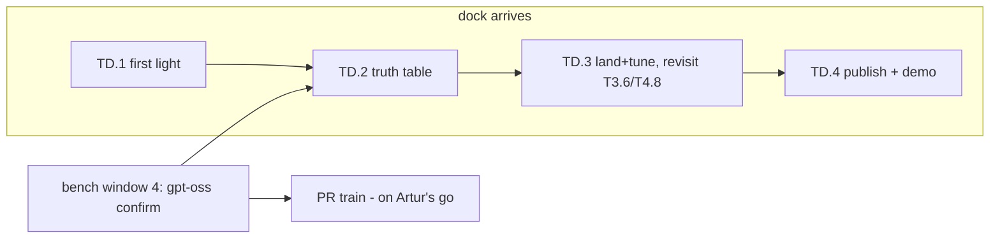

# TASKS.md — agent handoff for the Ampere-over-Thunderbolt effort

Task breakdown of `NV_LLM_DESIGN.md` (WS refs point there; context in `memory.md` — read both first).
Baseline `af2a43c85`; rebase on upstream master weekly. Written 2026-08-18, while the eGPU dock
(AOOSTAR AG02) is in the mail — **Phase 0 tasks need no NVIDIA hardware at all.**

> **STATUS 2026-08-19 (post wave 8):** 8 agent waves + 3 bench windows, ~50 tasks closed
> (✅/❌/📋 markers below; the **Status log** is the authoritative record). **All pre-dock code
> work is DONE.** Remaining before the dock: one bench confirm (gpt-oss with the T4.13 MXFP4
> fusion fix — expect 1.69 → ~20-40 tok/s), the on-hold **PR train** (T4.9 → T4.13 →
> T4.7+T1.8c-fix → T4.2 → T4.1 → T1.5/T1.6/T2.1/T2.2; submission gated on Artur, AI disclosure
> mandatory), and optional T2.4 (rented 3090). Closed pre-dock: fused attention (T4.8 final
> no-go — machinery built, waits for sm_86), Stage B bridge (parked for TD.3). All landed work
> merged on `integration/wave1`, gates green. Measured: qwen3:8b METAL decode 7.38 no-BEAM /
> ~14 BEAM vs llama.cpp 27.1; the remaining single-GPU gap is attention + prefill kernels.

## Conventions for agents

- Branch per task: `task/T<id>-<slug>` off baseline `af2a43c85` (== `origin/master`; no local
  `master` branch exists). Remotes: `origin` = arttarawork/tinygrad fork, `upstream` = tinygrad/tinygrad.
- Python env (Mac, verified 2026-08-18): no bare `python`; Homebrew python3.14 has no test deps.
  Use `/Users/artur/Documents/tinygrad/.venv` (numpy, torch, pytest+xdist, hypothesis, z3, gguf,
  mypy 1.19.1, ruff 0.14.10). From any checkout/worktree: `PYTHONPATH=. <venv>/bin/python -m ...`.
- Before pushing: `PYTHONPATH=. .venv/bin/python -m pytest <touched area> -x -q -n12`,
  `.venv/bin/python -m mypy tinygrad/`, `.venv/bin/python -m ruff check .`
- **Worktree agents: use RELATIVE paths for repo files.** Absolute `/Users/artur/Documents/tinygrad/...`
  paths silently resolve to the shared checkout (different branch!) — a T2.5 agent lost time to a
  phantom "stale file" bug this way. Absolute paths are correct only for the venv and model caches.
- Mac resource limits (updated 2026-08-18, after Artur freed ~157 GB): **~179 GB disk free** —
  model downloads are now fine (bench GGUFs go through `tinygrad.llm`'s fetch cache; gpt-oss-20b
  MXFP4 for T1.3 validation OK). **llama-server still keeps ~23 GB wired** (LaunchAgent KeepAlive)
  — before real-model METAL runs / T0.1 benchmarks, stop it: `launchctl bootout gui/501/com.artur.llama-server`
  (restart: `launchctl bootstrap gui/501 ~/Library/LaunchAgents/com.artur.llama-server.plist`).
  Tiny random-weight configs are fine anytime.
- Perf claims need before/after numbers from the T0.3 harness on named hardware. Upstream-bound
  changes must be small and hand-verified — maintainers have reverted "ai slop" before (see memory.md §4).
- Don't remove the deliberate `.contiguous()` calls in the MoE expert path (`llm/model.py:27,129`).
- `PYTHONPATH=.` when running from the clone.

## Execution environments

| Tag | Meaning |
|---|---|
| `ANY` | pure code; NULL/CPU device is enough (kernel-count and scheduling tests run on `DEV=NULL`) |
| `MAC` | the MacBook M3 Pro — Metal backend, real perf numbers today |
| `AMD` | (descoped 2026-08-18 — see T0.2; kept for the footgun note) the Bazzite box w/ RX 9070 XT. **Never** use the AM/PCI driver path there: it unbinds `amdgpu` and kills the display. |
| `MOCKNV` | NV backend under gpuocelot PTX emulation — functional correctness only, no perf. Recipe (T0.4, verified 2026-08-18): `OCELOT_PATH=.venv/lib/libgpuocelot.dylib DEV=MOCK+NV:PTX PYTHONPATH=. .venv/bin/python -m pytest ...` — the `DEV` string must start with `MOCK` (`device.py:376` never falls back to `MOCKIface` otherwise) and the dylib is CI's prebuilt (`github.com/tinygrad/gpuocelot` release v0.1.0, already at `.venv/lib/`). Do NOT use `extra/setup_mock_nv_osx.sh` (heavy source build + sudo to /usr/local/lib; CI doesn't use it either). Details: `MOCKNV_SETUP.md` on `task/T0.4-mocknv`. |
| `CLOUD3090` | optional: a rented Linux 3090 (vast.ai etc.) runs the same NV backend/kernels via `NVKIface` — real sm_86 perf for kernel work before the dock arrives |
| `DOCK` | blocked on the AG02 + TinyGPU |

## Phase 0 — no dock required

### T0 · Bring-up & baselines

- **T0.1 ✅ — Metal baseline table** `[MAC]` deps: —
  Clone on the Mac; run `python -m tinygrad.llm -m qwen3:8b --benchmark --warmup` (and qwen3.6:27b,
  qwen3-30b-a3b) on `DEV=METAL`, with and without `JITBEAM=2`; same GGUFs through `llama-bench` (Metal).
  *Done when:* a committed CSV/table of load / prefill / decode tok/s for ≥3 models × both stacks.
- **T0.2 — ~~Verify the 9070 XT as an HCQ testbed~~ DESCOPED (2026-08-18)** `[AMD]`
  AMD is not a target; the box was only a real-HCQ stand-in for validating shared `hcq.py` changes
  pre-dock. That role is covered better by `CLOUD3090` (same backend as target, NVKIface) and by
  upstream CI's AMD runners. Revive only if a cheap local HCQ sanity-check ever beats renting.
- **T0.3 ✅ — Bench harness** `[MAC]` deps: T0.1 (WS5.1)
  One script: same GGUF → `tinygrad.llm` + `llama-bench`, emits CSV (model, dev, flags, load s,
  prefill t/s, decode t/s, GB/s from `GlobalCounters`). Validated on Metal now; reused on NV later.
  *Done when:* T0.1's table is reproducible with one command.
- **T0.4 ✅ — Mock-NV bring-up** `[MOCKNV]` deps: —
  Get `DEV=NV` under gpuocelot green for `test/test_tiny.py` locally (Mac or Linux). Document setup
  quirks. This unblocks all NV-touching code tasks pre-dock.
  *Done when:* documented one-shot setup + passing test_tiny.

### T1 · Decode-path kernels & dtypes (WS1) — all measurable on Metal today

- **T1.1a ✅ — fp16 KV cache: implement + accuracy** `[ANY, runnable anytime]` deps: — (WS1.1)
  Explicit KV dtype at `llm/model.py` `_init_state` (default fp16, `KV_F32=1` escape flag); check
  every `_init_state` variant (attention, MLA, SSM conv/state — SSM state may need fp32, decide
  per-block with evidence). Accuracy: greedy-token parity + max logit delta vs fp32 over ≥5 prompts
  on llama3.2:1b (1 GB, fits anytime) AND a recurrent tiny-config. STOP if any family needs
  >1-line special-casing — report instead.
  *Done when:* diff + accuracy table committed; upstream-PR-shaped. Perf is T1.1b, not this task.
- **T1.1b ✅ — fp16 KV: measure decode delta** `[MAC, bench window]` deps: T1.1a, llama-server stopped
  T0.3 harness, qwen3:8b, fp32-KV vs fp16-KV on integration, no-BEAM + JITBEAM=2, long-context
  variant (`-p 4096`) where the KV read dominates. *Done when:* CSV rows + delta in BENCH_NOTES.md.
- **T1.2 ✅ — MATVEC heuristic: see through CAST** `[ANY→MAC]` deps: T0.1 (WS1.2)
  Reproduce the miss: `DEBUG=3` on a fp16/Q4 gemv, confirm no `MATVEC:` line (guard at
  `codegen/opt/heuristic.py:60-78` requires `MUL(INDEX,INDEX)`, real ASTs wrap it in CAST).
  Patch guard, add a kernel-selection unit test (NULL device), measure decode on Metal.
  *Done when:* heuristic fires on fp16+quantized gemvs; no regressions in `test/opt/`.
- **T1.3 ✅ — gpt-oss arch in `tinygrad/llm`** `[MAC]` deps: T0.1 (WS1.6)
  Wire the `gptoss` GGUF arch into `llm/model.py:340-451` + registry (`cli.py:76-94`); MXFP4 dequant
  already exists (`gguf.py:105-114`); training-side reference in `examples/mlperf/`. Validate
  gpt-oss-20b MXFP4 (~12 GB, fits the Mac's wired budget) output vs llama.cpp same-seed greedy.
  *Done when:* `-m gpt-oss:20b` generates correct text on Metal; benchmark row added.
- **T1.4 — Single-kernel MoE top-k — RESOLVED-AS-MEASURED (2026-08-18): premise was wrong.**
  `pairwise_topk` already costs exactly **1** kernel/layer in-model (control experiment on NULL:
  real topk vs free `arange` sel, all gating paths, T=1 and T=8). The scatter+slice+cast lower to
  an inlined select chain; only the rank reduce realizes, and rangeify's `remove_bufferize`
  (rangeify.py:258-282) makes 1 the floor (buffer-reading REDUCE can't inline into a consumer
  reduce). Alternatives (one-hot select, int32 scatter, `Tensor.topk` bitonic) all equal or worse.
  Landed tests-only (+19): exact tie-break equivalence vs numpy stable argsort + kernel-count pin.
  The other ~3 routing kernels/layer are the caller's probs path (gather + softmax stats,
  model.py:124-127) — a different, larger task if ever worth it.
- **T1.5 ✅ — Skip RNG at temperature 0** `[ANY]` deps: — (WS1.5)
  `llm/model.py:358-364`: bypass Gumbel noise when temp==0 without retriggering JIT capture.
  *Done when:* argmax path drops the threefry work; greedy outputs identical.
- **T1.6 ✅ — Cache `_prepare_jit_inputs`** `[ANY]` deps: — (WS2.4-adjacent)
  `engine/jit.py:200-218` re-derives state dicts every call (~0.5 ms/token host). Memoize safely.
  *Done when:* host time/token measurably down on Metal; JIT tests green.
- **T1.7 ❌ — Fused-attention track A: PCONTIG — DEAD END (2026-08-18).** PCONTIG fusion is
  numerically WRONG on multi-pass reduces (masked by the SCACHE bug T4.9 fixed), crashes Metal
  threadgroup limits at real GQA shapes, and sizes on-chip buffers by a symbolic Variable's static
  upper bound (compile crash at real max_context). Evidence: `PCONTIG_ATTN_NOTES.md` (merged).
  Do not wire PCONTIG into tinygrad/llm. Fused attention now routes through T4.7 ✅ → T1.8c → T4.8.
- **T1.8 ✅ — Fused-attention track B: pluggable custom kernel** `[MAC]` deps: T0.1 (WS1.4b)
  Add a clean attention-override hook in `llm/model.py:196` (pattern: `STUB_ATTENTION`,
  `extra/models/llama.py:104-119`; `Tensor.custom_kernel` is tested). Prove it with a naive Metal
  custom kernel; the tuned sm_86 kernel is T2.4/TD-side.
  *Done when:* hook merged behind a flag; parity test vs SDPA passes.
- **T1.10 ✅ — MATVEC for quantized (GGUF-fused) gemvs** `[MAC]` deps: T1.2 (WS1.2 follow-up, found 2026-08-18)
  T1.2 fixed fp16 but confirmed quantized gemvs miss MATVEC for two deeper reasons: the weight
  operand is a whole dequant expression (e.g. Q4_0: `MUL(INDEX, MUL(CAST(ADD(BITCAST(AND(...)))), ...))`
  with 3 INDEXes into one uchar buffer), and GGUF block substructure splits the row axis into
  multiple global axes (`full_shape=[32,2,16,1024]`). These are the dominant decode kernels for
  Q4_K models. Needs its own pattern match (or BEAM-informed hand-coded opts), not a CAST strip.
  *Done when:* MATVEC-class opts fire on Q4_0/Q4_K gemvs; measured GB/s uplift on Metal; no test/opt regressions.
- **T1.8c ✅ — Symbolic-Tk tuned attention kernel** `[MAC]` deps: T4.7 ✅ — done 2026-08-19: fires every token, byte-identical, ~2-3% slower than SDPA chain on 1B (T4.8 parked; qwen3:8b datum pending). Original scope:
  T4.7 made `custom_kernel` accept symbolic dims, but T1.8b's tuned kernel still can't fire past
  token 1: its CHUNK staging is a Python-level loop (`n_full = Tk // chunk; for j in range(...)`)
  needing a concrete int Tk. Rewrite the chunking kernel-side (a `UOp.range` over chunk index with
  a tail guard — no Python branching on Tk), keep the T1.8b structure (LOCAL threads, shared-mem QK,
  online softmax) otherwise. Then flip the fallback gate in `tinygrad/llm/attn_kernel.py`, verify
  T1.8's parity suite + `test_custom_kernel_symbolic_tk` pattern at symbolic Tk, and measure real
  llama3.2:1b decode with FAST_ATTN=1 (kernel now fires EVERY token) vs FAST_ATTN=0 — byte-identical
  tokens required. Honest expectation: still slower than the SDPA chain until T4.8 lands warp
  reduction — the deliverable is the working symbolic kernel + measurement, win or lose.
  *Done when:* gate flipped, parity green, real-decode delta measured. STOP if kernel-side chunking
  hits a codegen wall — document verbatim.
- **T1.9 ✅ — Streaming GGUF load** `[MAC]` deps: T0.1 (WS2.3-adjacent)
  Replace whole-file blob (`llm/gguf.py:134`) with per-tensor staging to cut the ~2x transient and
  TB-load cost; keep the io_uring fast path. Helps Metal load times immediately.
  *Done when:* peak load memory ≈ model size; load time not worse on Metal.

### T2 · Transport & runtime (WS2) — build now, tune on dock

- **T2.1 ✅ — Parallelize `_copyout`** `[MOCKNV→CLOUD3090]` deps: T0.4 (WS2.2)
  Mirror `_copyin`'s 32×2 MB round-robin (`hcq.py:559-576`) in `_copyout` (`hcq.py:596-609`).
  Shared HCQ code — write + functional-check under mock; real-hardware D2H bandwidth numbers from
  a rented 3090 (or post-dock). Upstream CI's AMD runners cover the AMD side of `hcq.py`.
  *Done when:* D2H bandwidth up on real NV hardware; `test/device/test_hcq.py` green.
- **T2.2 ✅ — Batch PTE writes / defer remote validation reads** `[MOCKNV]` deps: T0.4 (WS2.3)
  `nvdev.py:48-49` writes one 8-byte PTE per socket message; `memory.py:204-213` does blocking
  readback. Add a bulk-write path + skip validation on remote ifaces. Functional under mock; the
  latency win is measured post-dock.
  *Done when:* map_range socket-message count collapses (count messages in a fake iface test).
- **T2.3 ✅ — NV remote-tuning skeleton** `[MOCKNV]` deps: T0.4 ✅ (WS2.1)
  Prep a remote-keyed sizing layer for NV mirroring AMD's `is_usb()` knobs (`ops_amd.py:980-994`
  template): kernargs size, sigalloc, ring sizes, `bind()` bulk writes. Remote detection exists
  since T2.2 (`is_remote` on the MMIO iface). Values tuned post-dock; structure lands now.
  *Done when:* knobs exist with defaults = current behavior (mock-NV suites byte-green), one unit
  test asserting the knob set flips under a remote iface; no behavior change on NVK Linux path.
- **T2.4 — sm_86 kernel work on a rented 3090** `[CLOUD3090]` deps: T1.8 — *optional accelerator*
  Same NV backend, real tensor cores: BEAM sweeps on decode gemvs, tuned FA custom kernel for the
  T1.8 hook, MATVEC perf confirmation. Everything transfers to the eGPU minus transport.
  *Done when:* beam cache + FA kernel with measured tok/s vs Metal baseline.
- **T2.5 ✅ — Amortize the per-token sync** `[MAC]` deps: T0.1 ✅ (WS2.4)
  `generate()`'s per-token `.item()`: keep sampled tokens on device, drain every N for streaming;
  overlap the copyout with the next launch. Branch off `integration/wave1` (generate() moved:
  device-aware `t`/`temp` landed in review-fixes — re-locate the loop before scoping).
  *Done when:* host-visible stall/token down on Metal (T0.3 harness row); streaming UX unchanged (N≤4).

### T3 · Pooling groundwork (WS3 Stage A) — the sleeper: fully rehearsable pre-dock

Metal+CPU on the MacBook hits the *same three cross-backend blockers* as Metal+NV
(one-binary-per-`device[0]`, same-device kernel assert, no mixed graph capture) — so Stage A
can be built and proven before the dock ships.

- **T3.1 ✅ — Device-map plumbing in `tinygrad/llm`** `[ANY]` deps: — (WS3.A)
  `--device-map` (explicit ranges + `auto` by free memory): per-layer weight placement via
  `.to_()` before `load_state_dict` (loader honors pre-placed params, `nn/state.py:211-214`),
  per-layer KV-cache device (`model.py:200-204`), boundary copies at the `@function` block seam
  (`model.py:145-151`). Prototype homogeneous first: `("CPU:0","CPU:1")` / NULL.
  *Done when:* a model runs split across two same-backend devices with correct output.
- **T3.2 ✅ — Heterogeneous pipeline: METAL+CPU rehearsal** `[MAC]` deps: T3.1 ✅
  Swap one side for CPU. T3.1 already proved (homogeneous): mixed-device JIT capture works with no
  fallback, only COPY spans devices, and graph batching forms per-backend islands (METAL graphed,
  CPU sequential) — exactly the Stage A shape. Remaining here: do it cross-BACKEND, measure
  boundary cost/token, and **force realize for split models** (unrealized lazy initializers get
  captured and re-run every step — T3.1 finding).
  *Done when:* qwen3-8b runs layers split METAL/CPU, output correct, boundary cost quantified.
- **T3.3 ✅ — MoE placement policy** `[MAC]` deps: T3.2 ✅ (WS3.A)
  Sub-layer split: attention+norms+KV on device A, routed-expert FFN tensors on device B — extends
  `device_map` with per-tensor (not just per-block) placement for `ffn_*_exps`. Validate on a tiny
  MoE config first (exact-output test, both directions); then olmoe Q4 (~4.2 GB, registry —
  download OK, disk is fine) with experts on CPU and the rest on METAL (fits beside llama-server).
  Budget hops against T3.2's ~750 µs/copy floor — 2 hops/MoE-layer is the design's expected shape.
  *Done when:* MoE model runs with experts on the second device, outputs exact, hop count/token
  measured vs the 2/layer expectation. This is the flagship NV+METAL shape.
- **T3.4 ❌ — Zero-copy bridge spike (Stage B)** `[MAC]` deps: T3.2 ✅ (WS3.B)
  Wrap shared host memory across backends: `BufferSpec.external_ptr` on Metal (`ops_metal.py:157`
  at baseline — re-locate) over a CPU-visible buffer. The number to beat: T3.2 measured a
  **~750 µs FIXED cost per boundary copy** (overhead, not bandwidth) — if aliasing removes the
  copy, the hop cost should collapse toward sync-only. Target: eliminate the block-boundary
  activation copy in T3.2's METAL+CPU test pipeline, re-measure per-token cost. Also sketch (on
  paper, in the report) the HCQ-signal↔`MTLSharedEvent` bridge for the eventual NV side.
  *Done when:* one boundary copy eliminated + before/after per-token cost, OR analysis of why
  aliasing is unsafe (sync semantics, buffer lifetime, JIT capture) with the smallest viable alternative.
- **T3.5 — Boundary-copy microbenchmark — RESOLVED by T3.2 (2026-08-18):** METAL↔CPU table
  delivered (~750 µs fixed floor <1M elems, bandwidth above). Remaining: rerun on METAL↔NV post-dock.
- **T3.6 📋 — Async signal bridge — PRE-DOCK REHEARSAL REFUTED (2026-08-19), parked for the dock.**
  Bridge works (race-tested) but loses 20-35 µs net on METAL+CPU: CPU-producer sync is nearly free
  and Python dispatch (~300 µs) dominates; MetalGraph caps the drain cost in production. Capture-op
  design + sizing (~110-160 lines) in `SIGNAL_BRIDGE_NOTES.md` on the branch — revisit at TD.3
  when the producer is NV over the socket. Original scope kept below for that day:
- **(original T3.6 scope)** `[MAC→DOCK]` deps: T3.4 ❌ analysis
  T3.4 proved the boundary cost is SYNC (CPU-blocking `waitUntilCompleted` full-queue drain), not
  memcpy. Build the bridge: encode `MTLSharedEvent` `waitForEvent:value:` into the consuming Metal
  command buffer ahead of submit; a lightweight watcher signals it when the producer's HCQ signal
  word crosses the value (CPU HCQ2 signal for the pre-dock rehearsal; NV signal post-dock). The
  hard part is a JIT-capturable "wait on foreign signal" op — scope THAT first (where would it live
  in the captured graph? what does replay rebind?) and prototype METAL-consumer/CPU-producer on
  T3.2's split-model harness. Design sketch + primitives inventory: T3.4's report (`memory.md`
  session log pointer). *Done when:* one boundary hop runs without a full-queue drain, per-token
  cost measured vs the ~750 µs baseline, OR a scoped analysis of the capture-op gap. STOP before
  any scheduler surgery >~80 lines — report instead.

### T4 · Post-baseline work (added 2026-08-18, after waves 1-2 + measured baselines)

- **T4.1 ✅ — Upstream PR prep: MATVEC pair first** `[ANY]` deps: — (WS5/G3)
  Rebase `task/T1.2-matvec-cast` + `task/T1.10-matvec-quant` (as ONE combined branch off current
  `upstream/master`), re-run `test/opt/` + mypy + ruff, re-verify the fp16 + Q4_0 gemv wins still
  hold with a quick METAL microbench, and write the PR description: what/why, the measured numbers
  (56→100 GB/s fp16, ~4x membw Q4_0/Q6_K, and the +48% no-BEAM decode contribution from the
  baseline table). **Do NOT push or open the PR — Artur reviews and submits.** *Done when:* a
  rebased branch + PR-description file are ready for hand-off. (T1.5, T1.6, T2.1, T2.2 follow the
  same recipe as separate later tasks once this one lands cleanly.)
- **T4.2 ✅ — Q4_K dequant ALU cost** `[MAC]` deps: — (from T1.10's finding)
  T1.10 measured Q4_K gemvs ALU-bound (4x membw, flat wall-time; Q4_0/Q6_K got ~4x). Profile the
  Q4_K kernel (DEBUG=2 + generated source), identify the 6-bit sub-scale unpack cost, try ≤2
  targeted rewrites (e.g. restructure the scale-unpack expression in `llm/gguf.py` Q4_K dequant, or
  a BEAM comparison to see what search finds). STOP after 2 attempts if wall-time won't move —
  a written analysis is a valid outcome. Q4_K_M is the most common quant in the wild; this gates
  its decode win. *Done when:* Q4_K wall-time improves ≥15%, or the blocking analysis is committed.
- **T4.3 ✅ — gpt-oss-20b real-model validation** `[MAC, bench window — llama-server MUST be stopped
  (12 GB model)]` deps: T1.3 ✅
  `-m gpt-oss:20b` (GGUF cached): generate vs llama.cpp same-model same-prompt greedy (llama-cli
  `--temp 0`); token-level comparison over ≥3 prompts crossing the chunk_size=32 prefill boundary
  (exercises sliding-window × chunked-prefill, T1.3's untested interaction). Add a benchmark row
  via T0.3 harness while the window is open. *Done when:* parity verdict (exact or divergence
  documented with position/cause) + bench row committed.
- **T4.4 ✅ — BEAM prefill anomaly** `[MAC]` deps: — *small filler*
  Baseline table showed integration BEAM prefill 43.47 vs upstream 46.65 tok/s (single runs).
  3 repeats each side (harness exists); if the gap is real (>spread), bisect which wave lever
  costs prefill and why (likely MATVEC guard firing on a prefill kernel it shouldn't). STOP after
  attribution — fix is a follow-up. *Done when:* variance verdict or named culprit in BENCH_NOTES.md.

- **T4.7 ✅ — Upstream enabler: symbolic-shape `custom_kernel`** `[ANY]` deps: — (from T1.8b)
  `Tensor.custom_kernel` asserts `all_int(self.shape)`; the JIT's symbolic Tk therefore locks every
  custom kernel out of real decode. Investigate what breaks if custom kernels accept bound
  Variables (range construction? kernel cache key? memory planning?) and land the smallest
  upstream-shaped fix. Unlocks T1.8b's kernel AND T2.4's sm_86 flash kernel.
- **T4.8 📋 (scoped, deferred) — Upstream enabler: warp-reduce primitives in Metal renderer** `[MAC]` deps: — (from T1.8b)
  Metal codegen has no `simd_sum`/`simd_shuffle`; threadgroup_barrier+LOCAL is the only cross-lane
  reduction (measured dominant cost in T1.8b's kernel; caps custom kernels ~5% of bw). Scope what
  adding a simdgroup reduction primitive to the Metal renderer takes (renderer op, codegen
  pattern, correctness gating by threadgroup size). Benefits all GROUP reductions, not just attention.

- **T4.11 ✅ — gpt-oss decode reads ~25x too many bytes — NOT REPRODUCED at tiny scale (2026-08-19);** shared decode path exonerated (all 4 suspects refuted, regression test pinning <3x analytic); real-model chase moved to the bench-window docket. Original scope:
  Bench row (T4.3): gpt-oss-20b decode **1.69 tok/s at 100.65 GB/s** ⇒ ~60 GB read/token. Expected:
  ~2-3 GB (3.6B active params @ MXFP4 + KV) ⇒ ~30-40 tok/s ceiling. Something reads ~20-30x excess.
  Steps: (1) Reproduce at TINY scale first (synthetic gpt-oss config from `test_llm_gptoss.py`'s
  builder): measure `GlobalCounters.global_mem` per decode token vs the analytic expectation for
  that config — if the blowup reproduces small, iterate there (no 12 GB model, no bench window).
  (2) `DEBUG=2` kernel table for one decode step: which kernels read the excess? Suspects, in
  order: ExpertWeights gather degrading to dense-all-experts reads (check the `weight[sel]` kernel
  reads k experts' bytes, not E); the sinks manual-softmax path re-reading K/V multiple times;
  MXFP4 dequant materializing; masks built at full `max_context`. (3) Name the culprit; fix only
  if ≤2 targeted attempts move it, else commit the analysis. Real-model confirmation next bench
  window. *Done when:* culprit named with per-kernel byte attribution + fix-or-analysis committed.
  STOP if tiny scale does NOT reproduce — that finding (size-dependent, e.g. cache thrash) is the
  report; don't burn the window chasing it here.

## Phase 1 — dock arrives (`DOCK`)

- **TD.1 — TinyGPU first light**: install script, DEXT approval, `DEV=NV` test_tiny; audit
  `is_bar_small()` on the AG02 and where kernargs/cmdq land (design §3.1). deps: dock.
  **Pre-arrival intel (2026-08-20, github.com/Watcharasorn/mac-tinygpu-5070ti — same AG02 dock,
  5070 Ti + M4 Pro, WORKING):** preflight before any install (`system_profiler SPPCIDataType`
  shows 0x10de + a BAR/Memory range, Thunderbolt shows Link Up); power the eGPU before/with the
  Mac, direct cable, no hub; **no BAR range → STOP, collect debug, try dock/cable/port — do not
  loop installs, never disable SIP** (BAR-missing is a real M4 failure mode, upstream #16714);
  driver extension enable + reboot; Docker running before the nvcc helper. Their scripts/ dir is
  an adaptable preflight/bring-up harness. Our 3090 (sm_86, mature TC path) is better placed than
  their Blackwell card.
- **TD.2 — WS0 truth table**: full matrix via T0.3 harness — `DEV=NV{,:NAK}`, `JITBEAM={0,2}`,
  vs Metal + llama.cpp baselines. Names the real top-3 bottlenecks. deps: TD.1, T0.3.
  **External reference row (Watcharasorn, 5070 Ti/USB4, tinygrad f2c2f44, 2026-07-31):** decode is
  per-layer round-trip bound — ~26 ms/token floor for 16-layer models regardless of size
  (llama3.2:1b 37.6 tok/s ≈ olmoe 38.2), ~3.5 ms/layer at 36 layers (qwen3:8b 8.0 tok/s),
  effective BW capped ~31-38 GB/s on an 896 GB/s card; llama.cpp native CUDA same card:
  110-130 tok/s. First TD.2 question: why doesn't HCQGraph collapse the per-layer cost over the
  tunnel — that 3.5 ms/layer is the whole game, and T2.1/T2.2/T2.3 + drain_every>1 are the
  prepared levers. Their IQ3_XXS 35B blowup (~83 GB/token, upstream #17316) is T4.13's LUT
  mechanism on IQ quants — a scoped follow-up fix could close that issue.
- **TD.3 — Land the prepared work on real transport**: tune T2.3 knobs, validate T2.1/T2.2 wins,
  re-measure T1.x on NV, swap T3.2's CPU→NV = actual Metal+NV pooling. deps: listed tasks.
- **TD.4 — Publish**: upstream PR train (T1.1, T1.2, T1.4-6, T2.1-2 first — smallest, benchmarked);
  demo pooling to exo#1904 + tinygrad Discord. deps: TD.2 numbers.

## Dependency graph (remaining work only — updated 2026-08-19 post wave 8)

## Status log

| Date | Task | State | Branch | Notes |
|---|---|---|---|---|
| 2026-08-18 | env setup | done | `memory` | `.venv` created; `upstream` remote added; `test/test_tiny.py` green on METAL (19 passed) |
| 2026-08-18 | T1.2 | **done** | `task/T1.2-matvec-cast` | `1fbbcee83` (+17/−3): hypothesis CONFIRMED; `uncast()` strips one CAST at reduce body + MUL operands. fp16 4096² gemv 56→100 GB/s kernel-side (1.8x, METAL, noisy-machine caveat). test/opt+mypy+ruff green. Upstream-PR-ready. Spawned T1.10: quantized gemvs are a SEPARATE miss (dequant expr operand + block axes `[32,2,16,1024]`). |
| 2026-08-18 | T1.4 | **done (premise refuted)** | `task/T1.4-topk-1kernel` | `d24bdb713` (+19, tests only): topk is already 1 kernel in-model; 1 is the rangeify floor. Tie-exact + kernel-count tests pin it. 388 tests + mypy + ruff green. Design-doc "4 routing kernels" claim corrected. |
| 2026-08-18 | T1.5 | **done** | `task/T1.5-temp0-rng` | `f53ceb67f` (+51/−7): greedy uses `temperature=None` sentinel from `generate()`; jits keyed `(is_prefill, greedy)` — no recapture thrash. THREEFRY gone from temp-0 graph (rollout 35→33 kernels/token; RNG was full-vocab). Tests+mypy+ruff green. Note: old temp-0 path broke logit ties randomly; argmax (lowest index) is now the semantics. |
| 2026-08-18 | T1.6 | **done** | `task/T1.6-jit-input-cache` | `b5ddb2797` (+17/−3, jit.py only): caches per-input `substitute`+`unbind_all` keyed on view structure (interned-UOp identity; unsound-key guard + 32-entry cap). `_prepare_jit_inputs` 51.6→22.6 µs/call (−56%). 126 jit tests + mypy + ruff green. Note: `test/test_jit.py` doesn't exist at baseline — suites are `test/backend/test_jit.py` + `test/unit/test_jit*.py`. |
| 2026-08-18 | T3.1 | **done** | `task/T3.1-device-map` | `59d1eb2dd` (+88/−6): `parse_device_map` (ranges/auto-even/dict) + `--device-map`; placement before `load_state_dict`; `.to()` seam in forward (zero-cost when trivial). Split CPU:0/CPU:1 tokens identical to single-device; KV+freqs follow activations for free. **JIT captures the mixed trace end-to-end** — only COPY spans devices (asserted per captured call). Found upstream fused-rand_like bug (see memory.md §4). Tests+mypy+ruff green. |

| 2026-08-18 | wave-1 integration | **done** | `integration/wave1` | all 5 task branches merged (`2362f8f86`). One conflict (T1.5×T3.1 in `forward`: greedy branch + device hops combined) + one interaction fix (T3.1 test used pre-T1.5 `rollout_jit` name → `jit[(False, True)]`). Combined suite: 2401 passed, mypy + ruff clean. |
| 2026-08-18 | wave-1 code review | **done — 10 findings** | — | high-effort review of `integration/wave1`: 6 CONFIRMED w/ repros. Theme: device_map + jit-input cache work for pure-attention but **break on recurrent (GatedDeltaNet/qwen3.6) models** — zero recurrent test coverage in the diff. Also: warmup leaves sampled jits cold; parse_device_map unvalidated; uncast single-level; from_gguf positional break; greedy split across layers. |
| 2026-08-18 | review fixes | **done — all 10 fixed** | `task/wave1-review-fixes` | 8 commits → `528b27ea9`; repro-first (F1-F4 matched reviewer's exact errors), 9 new tests each verified failing pre-fix (incl. recurrent device-map coverage). 2410 passed (2401+9), mypy+ruff clean. `integration/wave1` fast-forwarded to it. |
| 2026-08-18 | T3.2 | **done — Stage A proven cross-backend** | `task/T3.2-metal-cpu` | `95891e58f` (+83/−2): METAL+CPU split runs with identical tokens (tiny attn+recurrent configs AND real qwen3:8b, 4 METAL/32 CPU under llama-server memory pressure — safe). JIT: capture succeeds, METAL graph-batches, CPU sequential, COPY structurally ungraphable. **Trap found+fixed:** lazy weight-placement COPYs were captured and replayed every step (21 spurious COPYs/token) — `from_gguf` now force-realizes only moved params. **Boundary copy floor: ~750 µs fixed METAL↔CPU regardless of size** (<1M elems; bandwidth only above) — the T3.5 planning number. Env note: agent sandbox cannot `launchctl bootout` llama-server; workaround = `DEV=CPU` + minority-on-METAL. |
| 2026-08-18 | T1.10 | **done** | `task/T1.10-matvec-quant` | `92986eb08` (+64/−6, stacked on T1.2): two fixes — weight operand matched via `.ranges` walk (dequant expr, not bare INDEX), and reduce-range selection scans for the bare-term split range (`pm_split_ranges` decomposes K into `[4096,128,2,16]`; the old `[0]` assumption picked the wrong one — only visible through real `.realize()`, so a real-pipeline test was added). METAL: Q4_0 ~10→41 GB/s, Q6_K ~15→47 GB/s (~4x); **Q4_K membw 4x but wall-time flat → ALU-bound on 6-bit sub-scale unpack, MATVEC can't help it** (real finding for the bench session). test/opt 38 green, mypy+ruff clean. |
| 2026-08-18 | rand-fusion bug | **done — NOT reproduced** | `task/rand-fusion-bug-repro` | `3b3f71331`: ~1,270 trials incl. bit-exact numpy-threefry check of fused RNG values (80/80 match) — no bug found; original T3.1 report possibly a harness artifact (the repro effort briefly self-generated an identical false positive via an inverse-Gumbel sign error). memory.md entry downgraded; repro harness + skipped tripwire tests kept on branch. No upstream issue filed. |
| 2026-08-18 | T1.3 | **done** | `task/T1.3-gptoss` | `6eeb4f241`+`95b569e65`: full gpt-oss arch — sinks (manual softmax path), even-layer sliding window (hardcoded, not GGUF metadata), YaRN rope, clamped swiglu, MoE biases; registry `gpt-oss:20b/120b` → ggml-org MXFP4. Synthetic parity vs numpy, mutation-tested 4 ways. **`gpt-4o` tokenizer preset added** (llama.cpp regex ported verbatim, capturing→non-capturing groups): roundtrips + harmony special tokens verified against the real 11 GB GGUF metadata-only; test skips without the file. All suites+mypy+ruff green. **Deferred to bench session:** real 20b generation vs llama.cpp greedy; chunked-prefill × sliding-window KV reuse. |
| 2026-08-18 | T0.4 | **done — GREEN** | `task/T0.4-mocknv` | `24581b7d5` (MOCKNV_SETUP.md only, no code changes). test_tiny 19 passed under `DEV=MOCK+NV:PTX` (+ test_hcq 29 passed, hevc compile). Recipe corrected in env table above; reproduced from main checkout. **T2.1/T2.2 (transport lane) now unblocked.** |
| 2026-08-18 | T2.1 | **done** | `task/T2.1-copyout-parallel` | `e31bb62d5` (+30/−4): `_copyout` joins the shared 32×2MB round-robin pool; drain-of-N overlaps device filling N+1; full-device sync removed from HW path. New wraparound test mutation-verified (catches 6% corruption when guard removed). Mock-NV 30+19 green; METAL doesn't route through this code. AMD USBIface (1 buffer) degenerates to old behavior. D2H bandwidth numbers deferred to real NV. |
| 2026-08-18 | T2.2 | **done** | `task/T2.2-pte-batch` | `1b8eabe52` (+148/−14): `set_entries` bulk PTE write (N writes → 1 slice write per contiguous run) + validation readback skipped when `vram.is_remote` (N reads → 0; `NV_VALIDATE_REMOTE=1` restores; AM byte-for-byte unchanged, guarded by test). Counting-iface tests verify N-independence at N=16/256. Mock-NV 19+29 green, AM external tests 7 green, mypy+ruff clean. Latency numbers deferred to dock. |
| 2026-08-18 | bench prep | done | — | qwen3:8b Q4_K_M (4.7 GB) pre-fetched into `~/Library/Caches/tinygrad/downloads/` via `tinygrad.llm` fetch — T0.1/T0.3 starts warm |

| 2026-08-18 | wave-2 integration | **done** | `integration/wave1` → `8d971f383` | all 8 wave-2 branches merged. Conflicts: heuristic.py (F9 while-uncast × T1.10 mat_ranges — combined) and model.py from_gguf (T1.3 config fields × device_map ctor — combined). Full suite **2420 passed**, mypy + ruff clean, mock-NV 49 passed, external NV/AM 11 passed. |
| 2026-08-18 | upstream sync | **done** | `integration/wave1` | merged `upstream/master` @ `2cfb421a8` (4 commits past baseline: KernelCountException, casted-const renderer migration, gptoss zero-2, CI deps) — zero conflicts, all gates re-green (2420 + mock-NV 49 + mypy + ruff). Task branches stay based on `af2a43c85`; rebase individually at upstream-PR time. |
| 2026-08-18 | T1.8 | **done** | `task/T1.8-attn-hook` | `6a6b2e3c5` (+164/−2, 19 lines in model.py): module-level `attention_impl` callable defaulting to exact SDPA; sinks/MLA/SSM paths untouched. Naive decode-only GQA custom kernel proves it: **4→1 kernels/layer on decode**, parity across shapes, prefill/masked fall back. **API sharp edge for the tuned-kernel task: `KernelInfo(opts_to_apply=())` is REQUIRED** for accumulate-reduce custom kernels (else silent wrong values or multi-store crash); KV-cache views work as inputs directly. 76 tests green, mypy+ruff clean. No STOP hit — custom_kernel fully expresses the target. Next: tuned Metal kernel now measurable; sm_86 version is T2.4/dock. |
| 2026-08-18 | T1.1a | **done** | `task/T1.1a-fp16-kv` | `70758216d` (+34/−8 model.py + 9 tests): fp16 default for attention KV, MLA compressed cache, SSM conv window (each 0/320 tokens diverged, ≤0.0034 logit Δ); **SSM `recurrent_state` stays fp32 unconditionally** — read-modify-write compounds fp16 error (7/320 diverged, 2.93 logit Δ, isolated to that buffer by experiment) and it's O(1) in context so no memory upside. llama3.2:1b real-model: 0/320 diverged, byte-identical text. Kernel counts unchanged (casts fuse). `KV_F32=1` escape (set before process start — getenv is cached). Perf = T1.1b next bench window. |
| 2026-08-18 | wave-3 integration | **done** | `integration/wave1` | T1.8 + T1.1a + T3.3 octopus-merged, **zero conflicts** (disjoint model.py regions as briefed). Full suite **2446 passed**, mypy + ruff clean, mock-NV green. |
| 2026-08-18 | T1.8b | **done — STOP hit, route-changing analysis** | `task/T1.8b-tuned-attn` | 3 commits (+235/−1): tuned kernel 26-68x over naive (LOCAL threads + shared-mem QK + online softmax + CHUNK=16 barriers) but still 0.12-0.5x of the SDPA chain. **Three structural blockers found: (1) `custom_kernel` asserts concrete shapes — JIT promotes Tk symbolic after token 1, so ANY custom_kernel attention (T1.8's naive too) only runs on the FIRST decode token in real serving (safe fallback + regression test added); (2) `opts_to_apply` and BEAM are mutually exclusive by construction — BEAM can't search custom kernels; (3) no simd_sum/shuffle warp primitives in Metal codegen → ~5% bandwidth ceiling.** The 4-kernel SDPA chain is already at ~46% bw at Tk=8192 — better than assumed. FAST_ATTN=1 kept default-off, falls back safely. 2087 tests, mypy+ruff clean. **Consequence: T1.7 (PCONTIG) is now the live fused-attention route; T2.4's planned custom FA kernel inherits blocker (1).** |
| 2026-08-18 | T4.2 | **done — 2x** | `task/T4.2-q4k-alu` | `78c1d02c5` (+10/−1 in gguf.py): root cause = block-level `d`/`dmin` fp16 unpack recomputed 32x/block inside the inner loop (sub-block `sc`/`mn` were fine). Fix: stage `d*sc`/`dmin*mn` as a tiny `.contiguous()` (8 floats/block, one-time load cost, bit-exact). **Q4_K gemv 414→201 µs — now FASTER than Q4_0 (224 µs)**; Q4_0/Q6_K unchanged; Q5_K shares the fix. 117+38 tests green, mypy+ruff clean. Upstream-PR candidate; expect a further qwen3:8b (Q4_K_M!) decode jump at the next bench window. |
| 2026-08-18 | T1.9 | **done — premise corrected** | `task/T1.9-stream-load` | `4289d3c8e` (+62/−8): **the "2x load transient" premise was WRONG** — mem_used stays flat at 1x through the old whole-file load (dequant fusion is lazy); the real 2.2-5.3x is **KV pre-alloc at native max_context in `_init_state`** (qwen3:8b +6 GB, llama3.2:1b +4.3 GB @131k ctx) → new task T4.6. The ≤64 MB batched staging still won: METAL llama3.2:1b at native ctx went from reliable OOM (one ~1 GB contiguous alloc) to 2/2 success; fast lane/fusion/device_map all preserved-and-verified. Its reported "pre-existing device_map test failure" does NOT reproduce here (3/3 solo + 25/25 -n12) — environment flake, watch it. |
| 2026-08-18 | T4.6 (new) | open | — | Lazy/growable KV allocation (or cap default `max_context` at CLI): `_init_state` pre-allocates native-context KV (up to 131k) = 2.2-5.3x model size before the first token. Options: allocate at `min(max_context, requested)`, grow in chunks on demand (watch JIT capture — cache tensor identity is baked into the graph), or just default the CLI to a sane ctx. `[ANY]`, evidence-first: measure which option keeps JIT replay valid. From T1.9's finding. |
| 2026-08-18 | wave-4 integration | **done** | `integration/wave1` | all 5 wave-4 branches merged, **zero conflicts**. Full suite **2463 passed**, mypy (215 files) + ruff clean, mock-NV green. |
| 2026-08-18 | T1.7 | **done — DEAD END (analysis-only, `PCONTIG_ATTN_NOTES.md`)** | `task/T1.7-pcontig-attn` | `509e01a18`, zero code changed. 3 structural blockers: **(1) PCONTIG fusion is numerically WRONG on multi-pass reduces** (softmax/SDPA: 0.52 max abs error vs numpy) — existing fusion tests pass only because **SCACHE's key ignores PCONTIG**, making fused-vs-baseline comparisons self-referential (SCACHE=0 flips 24/36 tests to failing, mse=72). (2) Metal threadgroup crash at real GQA shapes (whole score row on-chip, no tiling). (3) Symbolic Tk = compile crash — threadgroup buffers sized by the Variable's STATIC upper bound. Also: docs say PCONTIG=2 enables flash but code gates `>2` (needs 3). **Both Metal fused-attention tracks now dead → route = tune the correct 4-kernel chain + T4.7/T4.8 enablers.** |
| 2026-08-18 | T4.9 (new) | open | — | Upstream-shaped fix from T1.7's discovery: the schedule cache (`SCACHE`) keys on structural hash only, ignoring `PCONTIG` (and possibly other scheduling env vars) — same-process runs under different flags can serve poisoned cached schedules, and it silently masks broken experimental paths in tests. Fix: fold the relevant context vars into the cache key; expect the un-masked PCONTIG fusion tests to then fail honestly (they're wrong today, T1.7 proved it) — coordinate how to mark them. `[ANY]`, small, high upstream value. |
| 2026-08-18 | T4.6 | **done** | `task/T4.6-kv-prealloc` | `a302d9572`: `from_gguf` default now `DEFAULT_MAX_CONTEXT=8192` (was native — 131k for llama3.2:1b!); `None` = explicit native escape hatch; CLI was already safe (4096 default), library callers were the exposed path. `generate()` now asserts loudly on prompt ≥ max_context (was: silent empty generator or opaque reshape error). **Growable KV rejected by experiment: TinyJit silently ignores a swapped cache tensor — writes keep landing in the old buffer** (not even an error) — recapture-per-bucket would be required. KV prealloc on default path: 4.33 GB → 0.27 GB. Tests+mypy+ruff green. |
| 2026-08-18 | T2.3 | **done** | `task/T2.3-remote-knobs` | `a8cc52e61` (+86/−6): AMD `is_usb()` knob inventory mapped → NV `_LOCAL_SIZING`/`_REMOTE_SIZING` dicts (identical values today; post-dock tuning = values-only), kernargs/sigalloc/gpfifo/cmdq wired through. One justified gate beyond no-op: `NVCommandQueue.bind()` bulk-writes when the buffer view `is_remote` (200 socket writes → 1, counting-fake test; checked on the concrete view, not device type). Mock-NV 19+30 byte-green, external_nv 10 green, NVK path untouched. |
| 2026-08-19 | wave-5 integration | **done** | `integration/wave1` | T4.6 + T2.3 + T1.7-notes merged clean (T3.4 deliberately held out — refuted feature). Gates: 902 unit/opt/jit tests + mypy + ruff + mock-NV 49, all green. |
| 2026-08-19 | bench window 2 | **done** | `task/bench-window-2` | 4 commits → `d7cf9f5fb`; llama-server RESTORED after. **A:** integrated qwen3:8b decode 7.38 no-BEAM / 14.40 BEAM (≈flat vs 08-18's 7.28/14.44 — waves 3-5 moved GB/s accounting via Q4_K fix, not wall time; decode now gated by attention+other kernels; llama.cpp ref stable 27.07). **B (T1.1b done):** fp16 KV +2.2% decode at 4k ctx (grows with context, doesn't dominate yet); nil at 512. **C (T4.4 done — noise):** beam-prefill spreads fully overlap (47.4 vs 47.2 means); also proved `MV` is unreachable under BEAM (`apply_opts` branches before `hand_coded_optimizations`) — the design-doc culprit theory was structurally impossible. **D (T4.3 done):** gpt-oss tokenizer id-exact vs llama-tokenize; generation 64/64 exact on single-chunk prompts; **multi-chunk prefill (33-token prompt) diverges at generated token 26 → new T4.10**. gpt-oss bench row: 16.57 prefill / 1.69 decode tok/s. |
| 2026-08-19 | T4.10 (new) | open | — | Chunked-prefill × sliding-window divergence (from T4.3): prompt crossing `chunk_size=32` diverges from llama.cpp at token 26; single-chunk prompts exact. Isolate WITHOUT the 12 GB model: tiny synthetic sliding-window config, compare tinygrad-vs-ITSELF (chunk_size ≥ prompt vs chunk_size=8) — self-inconsistency ⇒ our sliding-window mask is wrong across chunk boundaries (likely the mask's window origin vs absolute start_pos); self-consistency ⇒ investigate llama.cpp's side before assuming fault. `[ANY]`, tiny models only. |
| 2026-08-19 | T4.7 | **done — plumbing fixed** | `task/T4.7-symbolic-custom-kernel` | `0b9c640bf` (~20 lines in ops.py): `placeholder_like` now reproduces rangeify's alloc-at-vmax + SHRINK-to-extent split (with bound-Var→PARAM conversion) that custom kernels never received; the old assert was masking that missing lowering. Proof: one compiled kernel replays across bound values 1-10 incl. never-captured values (cache keyed on variable identity); T1.8's naive attention kernel now runs symbolic Tk correctly. **T1.8b's tuned kernel still gated — its Python-level CHUNK loop needs concrete Tk (kernel-algorithm limit, not plumbing) → T1.8c.** Concrete-shape callers byte-identical. 109+864 tests, mypy+ruff clean. Upstream-PR candidate. |
| 2026-08-19 | T1.8c (new) | open | — | Rewrite T1.8b's tuned attention kernel with kernel-side chunking (UOp.range over chunks instead of the Python `for j in range(n_full*chunk, Tk)` staging) so it accepts symbolic Tk via T4.7's fix; then flip the FAST_ATTN fallback gate and measure real llama3.2:1b decode with the kernel firing EVERY token. If it wins, T4.8's >32-lane warp-reduce work becomes live. `[MAC]`, deps: T4.7 ✅. |
| 2026-08-19 | wave-6 integration | **done** | `integration/wave1` | T4.7 + T4.8-notes + T4.9 + T4.10 merged clean. 974 passed / 29 xfailed (24 = T4.9's honest PCONTIG flips), mypy + ruff clean. |
| 2026-08-19 | T4.8 | **done — scoped, deferred** | `task/T4.8-metal-simd` | `aff95d7b7` (METAL_SIMD_NOTES.md only). NOT renderer-local: barrier+LOCAL is built backend-agnostically in `fix_group_for_reduce` before any renderer sees it; NO backend has warp reduction (framework-wide gap, not Metal lag); only capability precedent is WMMA/TC. **Correctness trap: naive `simd_sum` is unsound for MATVEC's real kernel (GROUP=8 × LOCAL=4 share one simdgroup — would sum across output rows silently)**; partitioned shuffle-tree needed even for ≤32 lanes. Sized: ~300-550+ lines across 5 files incl. new Op + capability flag. Recommendation: revisit only if T4.7 reopens custom-kernel decode traffic; start from the >32 two-level case. |
| 2026-08-19 | T4.9 | **done — prime PR candidate** | `task/T4.9-scache-key` | `c2d107868` (+54/−1, 9 lines in schedule/__init__.py): key now folds in **9 schedule-affecting ContextVars** (PCONTIG confirmed + SPLIT_REDUCEOP, MAX_KERNEL_BUFFERS, FLOAT16, OPENPILOT_HACKS, IMAGE, RING, ALL2ALL, ALLREDUCE_CAST — the multi-device vars had the same cross-serve bug latent). Full audited inventory incl. excluded-with-reason list. 24 vacuous rangeify tests flipped to honest xfail (referencing T1.7); cross-serve proof test verified failing pre-fix; timing delta nil (1.289 vs 1.293 ms). 877 passed, mypy+ruff clean. Idiom precedent: CAPTURE_PROCESS_REPLAY does the same. |
| 2026-08-19 | T4.10 | **done — NOT our bug** | `task/T4.10-sliding-chunk` | `f66fc48a6` (+91 tests only): tinygrad is **chunk-invariant** — identical tokens at chunk_size ∈ {2..32} vs single-chunk across seeds/prompt-lengths incl. the exact T4.3 shape; mask algebra verified position-invariant (both tri terms in absolute coords, symbolic-start_pos safe); numpy-oracle test at 4 chunkings added; prefix-resume also clears. T4.3's divergence ≈ cross-implementation FP drift flipping a near-tied argmax (both continuations were fluent). Confound flagged: T4.3's prompt 3 was longest AND only chunked — next bench window: same prompt at chunk_size=64 to separate length from chunking. |
| 2026-08-19 | T1.8c | **done — kernel fires every token** | `task/T1.8c-symbolic-attn` | `ef5c1b829`: kernel-side chunking worked first try (`ceildiv` into REDUCE range + clamp-index/`valid.where(-inf)` tail mask); concrete shapes 0.99-1.03x (no regression). **Also fixed a 2nd T4.7 gap: `to_kernel_param` didn't recurse into compound exprs (real Tk = `start_pos+T`) — 4-line root-cause fix in ops.py; fold into the T4.7 PR when prepped.** Real decode llama3.2:1b: byte-identical tokens, 24.12 (off) vs 23.5-23.6 (on) tok/s = ~2-3% loss with kernel live on all 16 layers. **T4.8 go/no-go: stays PARKED** — a 1B-scale loss doesn't clear a 300-550-line bar; one cheap datum left: FAST_ATTN on qwen3:8b (Hd=128, longer ctx) at the next bench window before calling it final. 2085 tests, mypy+ruff clean. |
| 2026-08-19 | wave-7 integration | **done** | `integration/wave1` | T1.8c + T4.11 + T3.6 merged clean; 975 passed, mypy + ruff clean. **Phase 0 pre-dock code work is now COMPLETE** — remaining: bench-window docket, PR train (Artur's go), dock. |
| 2026-08-19 | T3.6 | **done — refuted PRE-DOCK; re-evaluate post-dock** | `task/T3.6-signal-bridge` | `4d323f271` (notes + tests only, nothing wired). Working MTLSharedEvent bridge built + race-tested, but **20-35 µs net LOSS** vs `CPU.synchronize()`: eager dispatch is ~280-300 µs of Python per call, CPU-producer sync is nearly free by then, and a live watcher thread costs 20-35 µs regardless (wakeup itself ~4 µs). Confirmed METAL full-drain DOES scale with in-flight work (150 µs → 1134 µs at K=64) — but production's MetalGraph collapses steady state to K≈0-1. Capture-op sized: ~110-160 lines across 5 files (over STOP budget). **Verdict: park Stage B until the dock — re-measure with real NV-signal/socket latencies where the round trip is 100x CPU's.** |
| 2026-08-19 | T4.11 | **done — NOT reproduced at tiny scale** | `task/T4.11-gptoss-bytes` | `e114fe1d8`: gpt-oss config (exact routing 32/top-4 + all mechanisms) vs size-matched control = 1.3% apart, both ~1.25-1.28x analytic gathered-MoE (dense would be ~8x) — even at real per-layer dims (2880). All 4 suspects refuted with per-kernel byte isolation (patched track_stats; DEBUG=2's "mem" is cumulative, unusable). Regression test added: decode bytes <3x analytic (guards gather→dense forever). False alarm documented: forgetting `realize_placement()` reproduces an 8x blowup — harness mistake, real callers via from_gguf are safe. **Real-model 1.69 tok/s chase → next bench window** (suspects now: MXFP4 dequant at 20B scale, or bench-methodology artifact — check the harness's reported GB/s derivation too). |
| 2026-08-19 | bench window 3 | **done** | `task/bench-window-3` | 4 commits → `0125a8144`; llama-server RESTORED. **A: T4.8 FINAL NO-GO** — FAST_ATTN wash at p512 (+0.05%), +2.09% single-run at 4k ctx: not fundable. **B: T4.10 CONFIRMED closed** — chunk_size 32 vs 64 byte-identical on real gpt-oss, both diverge from llama.cpp at the same token: FP drift. Found new bug → T4.12. **C: the ~60 GB/token is REAL** (harness GB/s was never the artifact — uses global_mem correctly); per-kernel time (JIT_BATCH_SIZE=1 to see through Metal graph batching): two MXFP4-dequant-shaped ELEMENTWISE kernels eat ~90% of decode (406+92 ms of a ~555 ms step) — **MXFP4 dequant materializes per token at 20B scale** (fuses fine at tiny scale, hence T4.11's non-repro) → T4.13, the biggest remaining Metal lever. JITBEAM=2: −12.5% decode, no rescue. **D: headline stable** (7.383; BEAM 12.62 inside the known noise band). No swap all window. |
| 2026-08-19 | T4.12 (new) | open | — | `warmup()` hardcodes `chunk_size=32` and the jit dispatch key omits chunk_size → `warmup()` then `generate(chunk_size=64)` raises JitError (prefill capture bakes the v_toks bound). Fix smallest-sound: key the prefill jit by chunk_size (bounded dict, like the (is_prefill,greedy) split) OR pass chunk_size through warmup; either way add the two-chunk-size test. `[ANY]`, tiny models, branch off `integration/wave1`. |
| 2026-08-19 | T4.13 (new) | open | — | **gpt-oss MXFP4 dequant materializes per decode token at real scale** (attributed in bench window 3: `E_1036800_8_16_2` 406 ms/73% + `E_86400_32_3` 92 ms/16.5% of a decode step; ~59 GB/token confirmed real; fuses correctly at tiny scale per T4.11). Find the scale threshold: grow T4.11's synthetic config (dims/experts) until the E_ kernel appears — the transition names the cause (suspect: MAX_KERNEL_BUFFERS or a bufferize forced by the 32-expert real-dim tensor count; also check the MXFP4 scales expression in `gguf.py:105-114` vs T4.2's staged-Q4_K pattern). Fix ≤2 attempts (a T4.2-style one-time staging of scales is the likely shape — must NOT rematerialize full fp16 weights) else analysis. Expected payoff: 1.69 → ~20-40 tok/s, the biggest remaining Metal lever. Mid-scale configs fit beside llama-server; real-model confirm next window. `[ANY→MAC]`. |
| 2026-08-19 | T4.13 | **done — FIXED, 44x byte reduction** | `task/T4.13-mxfp4-fusion` | `312995161`+`b6aa59ba0`: NOT scale-dependent — reproduces at dim=64 the moment weights go through real MXFP4 dequant. **T4.11's coverage gap explained**: its byte test used raw fp32 weights; its GGUF test quantized ONE tensor. Root cause: MXFP4's **LUT gathers** (`lut[codes]`) put a buffer-reading REDUCE inside the dequant, and rangeify's `buffer_in_reduce` check refuses to fuse that into `weight[sel]` — so ALL 32 experts materialized every token. Fix: LUTs → pure ALU bit-ops (bit-exact, verified all 256 e8m0 bytes × 16 codes). **2.42 GB → 55 MB/token/layer (44x), 1.04x analytic.** Real-dims regression test with ALL tensors quantized added. 136+ tests, mypy+ruff clean. **Upstream-PR candidate. Real-model tok/s confirm = next bench window (expect ~1.69 → 20-40).** |
| 2026-08-19 | wave-8 integration | **done** | `integration/wave1` | T4.12 + T4.13 merged clean; 917 passed, mypy + ruff green. |
| 2026-08-19 | T4.12 | **done** | `task/T4.12-warmup-chunk` | `94aed8ae5` (+72/−10): root cause deeper than expected — `resolve(tokens.shape[1]!=1)` can't concretize the symbolic toks range (1..chunk_size) and falls back `default=True`, so EVERY first step captures as prefill with vmax=chunk_size baked in. Fix: jit keyed `(is_prefill, greedy, chunk_size|None-for-rollout)`, lazy dict; rollout stays singular; recurrent path (range collapses to (1,1), resolves concretely) unaffected. Latent for cli/serve, live for the bench harness. 97 tests, mypy+ruff clean. |
| 2026-08-19 | bench window 4 | **done — T4.13 CONFIRMED at real scale** | `task/bench-window-4` | 3 commits → `efb436066`; llama-server RESTORED. **gpt-oss-20b: decode 1.69 → 10.97 tok/s (6.5x); JITBEAM 1.48 → 15.52 (+41.5%, beam flips from hurting to helping); prefill 16.6 → 41.8; bytes 59.3 → 3.46 GB/token (17x — the 44x was single-synthetic-layer; 3.46 ≈ sane vs ~2-3 analytic).** Parity: prompt 1 byte-exact vs llama.cpp; a reconstructed single-chunk prompt diverges at token 27 — plausibly the T4.10 FP-drift class (fusion changes accumulation order; dequant VALUES are bit-exact) — pre/post-fix bisection optional if it ever matters. Stability: qwen3:8b 7.37 (no regression from waves 7-8; llama3.2:1b proven byte-identical vs pre-wave-8 checkout); llama3.2:1b-vs-llama.cpp drift confirmed PRE-existing. **Long-ctx finding: 2k-prompt decode drops 68.5% while bytes grow 11.6% — gpt-oss long-context is now attention-COMPUTE-bound on Metal → strengthens the T2.4/sm_86 case for the dock.** No swap all window. |
| 2026-08-19 | fork CI red (PR #1) | **fixed — merged to integration** | `task/ci-green-cpu` | Artur pushed integration/wave1 + opened fork PR #1 → 13 failed checks. Triaged: 10 = fail-fast cascade; 3 real, ALL reproduce locally with **DEV=CPU** (CI's Linux default — our gates always ran METAL-default, a real gate gap). Fixed (`8767bd2c9`, +45/−5): (1) `tuned_decode_attention` falls back via `renderer.has_local` (naive kernel verified unaffected — WEAK axes never hit gpudims); (2) flake root cause was NOT threefry-counter drift (disproven bit-for-bit) — sharing ref's unrealized weight UOps with split lets ref's JIT capture realize the shared graph first and corrupt split's use; test-only (all in-tree load_state_dict call sites grepped: disk→one model); fixed by realizing ref params pre-copy; (3) **latent PRODUCTION bug found: `realize_placement()` called bare `Tensor.realize()` when the map canonicalizes entirely to Device.DEFAULT** — fixed in the shared function. Full CI repro 2004 passed; both device defaults green; mypy+ruff clean. Gate lesson adopted: run DEV=CPU passes on llm-touching work. Env gap closed 2026-08-19: Artur installed `llvm@20` (brew, keg-only) — tinygrad autodetects it, no LLVM_PATH needed, `test_arch_feats` green; CI's SPEC=2 suite is now 100% locally reproducible. |
| 2026-08-19 | fork CI round 2 | **fixed + pushed, CI re-running** | `integration/wave1` @ `463bedcf4` | gh CLI now authed (logs directly readable — huge triage upgrade). Round-2 root causes, both test-only, neither reproducible on this Mac: (1) `test_signal_bridge_metal.py` imports objc/Metal at module level → collection error on ALL Linux jobs (`libSystem.dylib`); Darwin guard added. (2) `TestDeviceMapMetalCPU` asserts METAL graph-batching, but GitHub's paravirtualized Metal disables MetalGraph (ops_metal.py documents this) → assertion now conditional on `Device["METAL"].graph`. Pushed via gh HTTPS helper (SSH is interactive-only). **RESULT: 53 pass / 1 fail — all four round-1 failures GREEN (SPEC=2 ×2, Unit Tests, MacOS unit).** The one fail (`In-tree Autogen (comgr 2)`) is a STRUCTURAL fork limitation, confirmed by rerun: the job apt-installs ROCm 6.2 from repo.radeon.com inside a 15-min budget — rerun died at exactly 15:00 in the install step both times; upstream runs it on their fast namespace runners, forks get stock ubuntu and lose the race. Not our code (zero autogen changes). **Fork CI verdict: fully green on everything that can run — 53/53 real checks.** |
| 2026-08-19 | upstream sync #2 | **done + pushed** | `integration/wave1` @ `b42cc0a0a` | merged `upstream/master` @ `b8cc74ecf` (15 commits: casted-consts migration completed incl. cstyle/x86, fused_qkv_rope attempted+reverted upstream, roll/bitcast fixes) — zero conflicts, all gates green incl. CI's DEV=CPU SPEC suite (2004) and mock-NV. Artur pushed both refs (gh token lacks `workflow` scope for CI-file changes; SSH push interactive-only). **Fork `master` now mirrors upstream tip** — PR #1 diff is now exactly our work. Post-sync CI: first run had 15 setup-timeout "fails" (self-inflicted: the master push ran a SECOND full matrix concurrently — lesson: stagger master/branch pushes); rerun cleared 12; final 3 (`CPU:LLVM`, `amd gfx950`, comgr-2) all traced to **third-party apt mirrors hanging** (apt.llvm.org, repo.radeon.com) — 20-min silent apt hangs, twice, after deps installed from cache in seconds. Zero tests failed anywhere; the tree passed all 53 real checks pre-sync and passes everything locally. Retry `gh run rerun 32295828258 --failed -R arttarawork/tinygrad` when mirror weather clears. |
| 2026-08-19 | ultrareview (PR #1) | **done — 1 finding, fixed + pushed** | `integration/wave1` @ `68adb9cb9` | Cloud multi-agent review of the full 8-wave diff (attempt 1 died in the orchestrator and consumed a free slot; attempt 2 in PR mode succeeded). One verified finding: **MLATransformerBlock._init_state dropped all 5 yarn kwargs** (T1.3 threaded them into TransformerBlock only) — yarn-configured MLA models (DeepSeek-V2/V3, possibly moonlight) silently got unscaled rope past yarn_orig_ctx. Mechanical mirror + regression test (proven failing pre-fix). 99 llm tests, mypy+ruff green, pushed. Everything else in 4,074 added lines came back clean. |
| 2026-08-18 | device_map flake | SOLVED (see fork-CI row: DEV=CPU trigger) | — | 2 independent agent sightings (T1.9, T4.6: `test_split_matches_single_device`, `test_experts_split_matches_unsplit_homogeneous` fail in THEIR worktrees, verified pre-existing via stash) but **0/2 reproductions on the quiet main checkout** (solo ×3, file -n12, full `-k llm` -n12 all green). Pattern: only under concurrent multi-agent machine load in `.claude/worktrees/*`. If a third sighting lands: dedicate an investigation task (suspects: cross-test state via `manual_seed`/module globals under xdist, or load-dependent scheduling nondeterminism). Do NOT "fix" blind. |
| 2026-08-18 | T3.4 | **done — hypothesis REFUTED** | `task/T3.4-zero-copy` | `8e70a80a5`, **NOT merged into integration** (working aliasing behind `ZERO_COPY=1` + sync-semantics tests, but zero measured win: alias ≈ copy at every scale). Root cause isolated: **the fixed per-hop cost is SYNCHRONIZATION, not memcpy** — `Device.synchronize()` after any dispatch is a ~150 µs `waitUntilCompleted` full-queue drain both paths pay. Also: Metal `external_ptr` takes an ObjC MTLBuffer id, NOT a raw pointer (CPU-owned pointer → hard crash; only METAL-owns/CPU-borrows works). Branch kept as evidence + the sync-semantics test suite; aliasing machinery not worth carrying. |
| 2026-08-19 | T3.6 (new) | open | — | **The real Stage B item (replaces aliasing):** async signal bridge. Convert the cross-backend sync from CPU-blocking full-drain to a GPU-side dependency edge: encode `MTLSharedEvent` waitForEvent into the consuming command buffer ahead of submit; a watcher signals it when the producer's HCQ signal word (NV — or CPU HCQ2 for a pre-dock rehearsal) crosses the value. Needs a JIT-capturable foreign-wait op + buffer-lifetime coordination. Full sketch in T3.4's report. Bigger task; matters most post-dock but METAL↔CPU rehearsal is possible now. |
| 2026-08-18 | T2.3 | agent running | `task/T2.3-remote-knobs` | wave 5: no-op remote knob skeleton, selection-path test; values post-dock |
| 2026-08-18 | T2.5 | **done** | `task/T2.5-sync-amortize` | `2b1470d73` (+129/−9): chained-K landed — decode already chained on-device (`.item()` was pure host bookkeeping); now launches ≤`drain_every` steps then one batched drain. Gotcha found: TinyJit reuses output buffers across replays → deferred tokens need `.clone().realize()` (drain_every=1 stays zero-extra-op). **Default 1** (existing per-call test contracts); N=4 opt-in. Metal llama3.2:1b: ~0.25-0.76 ms/tok saved (~1-2%, compute-dominated) — real payoff is the TB socket round-trip floor later. EOS mid-window: ≤N−1 wasted device steps, yielded sequence unchanged. 83+20 tests, mypy+ruff clean. |
| 2026-08-18 | T4.5 | **done** | `task/T4.5-force-realize` | `d8f02dd90` (+72/−27): `Transformer.realize_placement()` — one home for the T3.2 force-realize, from_gguf delegates, manual loaders call it post-load; asserts on params stranded outside the map (correctness bug, not a warning). T3.3's test helper deleted; dense split test's captured-copy assertion tightened to EXACTLY one boundary hop (T3.3's 39-copy pollution closed). 79 tests, mypy+ruff clean. Kept fork-side (rejected touching upstream `load_state_dict` — rationale in report). |
| 2026-08-18 | T3.3 | **done** | `task/T3.3-moe-placement` | `6b942a18d` (+174/−18): `experts:<dev>` device_map segment; router stays with block. Mid-block hops capture/replay fine in JIT (no new mechanism needed). **Hop count = 3 copies/MoE-layer, not 2** (`sel` must travel with `h` for the weight gather) — verified exactly on tiny configs AND olmoe (48 copies = 16×3). olmoe METAL+experts:CPU tokens exact vs all-CPU. **Design rule discovered: the GGUF load device must be the BIG-memory side** — moving the big expert tensors across a boundary force-realizes them at full fp16 (~13 GB for olmoe), defeating fused dequant; move the small attention share instead. 788 unit tests green. Incidental: manual-`load_state_dict` callers miss `from_gguf`'s force-realize fix (captured-COPY trap, pre-existing) — filler task below. |
| 2026-08-18 | T4.5 (new filler) | open | — | Move the T3.2 force-realize fix from `from_gguf` into `load_state_dict`-adjacent code (or a `Transformer` post-load hook) so manual-load callers get it too; also give hand-built weights a device= footgun guard (`Tensor.randn` strands params on `Device.DEFAULT`). Small, `[ANY]`, branch off `integration/wave1`. |
| 2026-08-18 | T4.1 | **done — ON HOLD per Artur** | `task/T4.1-matvec-pr` | `d6da66dce` (amended) on upstream tip `e37b44d04`. One 29-line heuristic.py commit + 3 tests + PR_MATVEC.md. Re-verified on tip: fp16 gemv ~1.4x (105 vs 75 GB/s), Q4_0 ~4x (42 vs 11 GB/s); MV=0 ≡ unpatched control. **Artur 2026-08-18: no upstream PRs for now; when submitted, AI usage disclosed upfront** — PR text now carries a disclosure section + Co-Authored-By trailer in the suggested commit message. Applies to all future T4.x PR-prep tasks. NOT pushed. |
| 2026-08-18 | T0.1+T0.3 | **done** | `task/T0.3-bench-harness` | `fb2356ac0`: harness (`extra/bench_llm.py` wrapper + GB/s in `benchmark_llm.py`) + CSV + BENCH_NOTES.md. **METAL qwen3:8b Q4_K_M decode tok/s: llama.cpp 27.27 · upstream no-BEAM 4.92 · integration no-BEAM 7.28 (+48%) · upstream BEAM 12.86 · integration BEAM 14.44 (+12%, 53% of llama.cpp)**. Prefill flat no-BEAM (levers are decode-only); BEAM prefill slightly down on integration (single runs, unchased). llama-server stopped for the window and RESTORED after. |

## Parallelization notes

Remaining lanes (updated 2026-08-19, post wave 8): **(a)** bench window 4 — the T4.13 real-model
confirm (+ post-wave-7/8 headline stability); **(b)** PR train on Artur's go; **(c)** dock (TD.x).
No launchable code tasks remain pre-dock.
Agent policy: one tight objective per agent, Sonnet at max effort, explicit STOP conditions,
commit early, RELATIVE paths in worktrees; verify premises with a control experiment before
optimizing (T1.4/T1.9/T4.10 all refuted their premises — cheapest work of the project).
